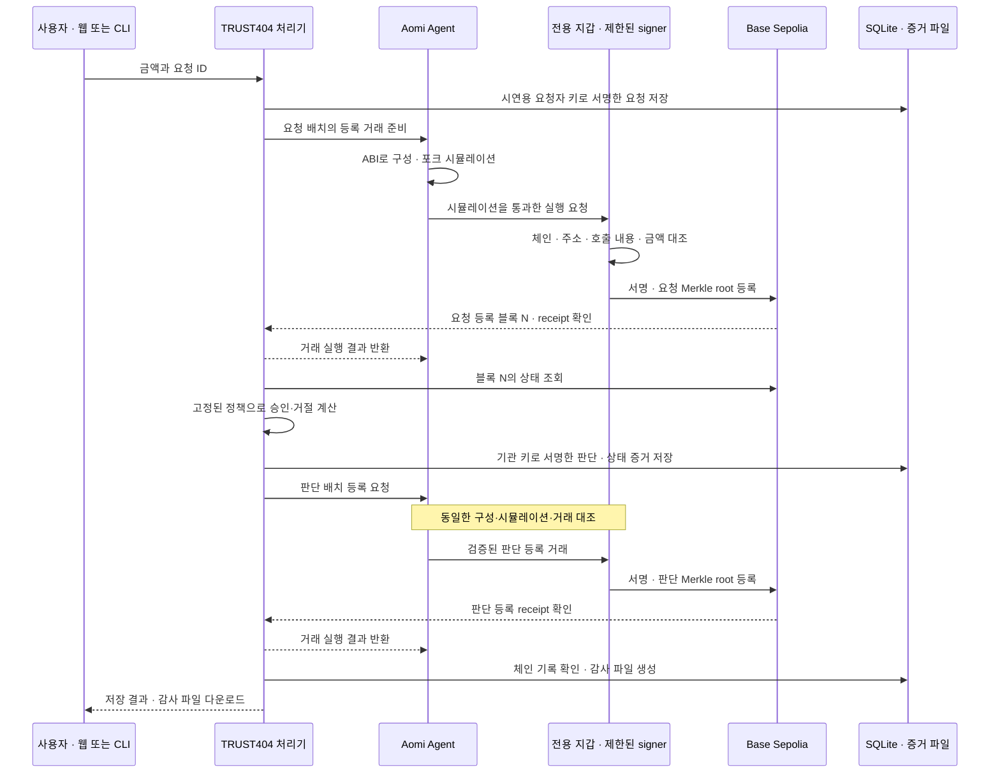
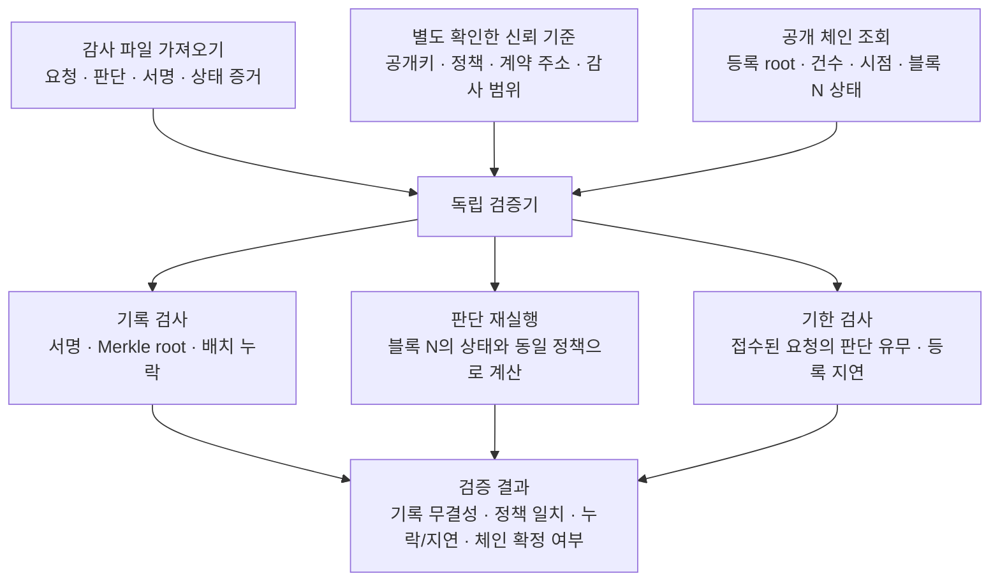

# TRUST404 — 거절에도 검증 가능한 기록을

거절된 요청은 송금 내역에 남지 않습니다. TRUST404는 요청과 승인·거절 판단을 서명하고, 그 기록의 Merkle root를 체인에 등록합니다. 감사자는 기관의 서버·DB 없이 **감사 파일과 공개 체인 정보로 변조·누락·등록 지연을 확인하고 당시 정책을 다시 계산**합니다.

## 현재 구현

- **기록:** 요청 저장 → 요청 등록 거래 → 등록 블록의 상태로 판단 → 판단 등록 거래 → 감사 파일 생성.
- **감사:** 한국어 화면에서 JSON 파일 하나를 가져와 검증. 지갑 연결 불필요.
- **저장:** 원문·서명·상태 증거는 SQLite와 파일에, root·건수·등록 시점은 `RecordAnchor`에 저장.
- **실제 시연:** Base Sepolia에서 Aomi 경유 등록과 파일 감사 확인. 공개 예제의 마지막 요청은 요청 등록부터 판단 등록까지 78초.

현재는 **테스트넷 시연용 프로토타입**입니다. 승인·거절 판단과 증거 등록을 수행하며 USDC를 실제 송금하지는 않습니다. 요청자·기관 키도 시연용이며, 고객 인증·운영용 키 관리·외부 공개 저장소는 미구현입니다.

## 흐름도



**체인에는 원문이나 Merkle 트리 전체를 넣지 않습니다.** 각 배치의 root·건수·등록 블록·시각을 저장하고, 요청·판단 원문과 서명·상태 증거는 파일로 보관합니다. 시뮬레이션 실패나 거래 불일치가 발생하면 서명 단계에서 중단합니다.

공식 SDK `@aomi-labs/client`와 SIWE 지갑 로그인을 사용합니다. Aomi의 호스팅된 기본 Agent 런타임을 호출하며, 실패한 시뮬레이션이나 원본과 다른 거래는 서명하지 않습니다. 서명 키는 로컬 전용 테스트넷 지갑에 있습니다. **Privy hosted 자동 서명, 커스텀 App 배포, x402 결제를 사용한 구현은 아닙니다.**

판단 규칙은 LLM이 결정하지 않습니다. 우리 코드가 고정된 블록 상태로 계산하고, 감사자도 같은 규칙을 독립적으로 재실행합니다. Aomi 실행 이력은 보조 자료이며 감사 증명 자체를 대신하지 않습니다.

## 감사 파일은 어떻게 검증되는가



감사자는 **기관 DB·개인키·Aomi 계정 없이** 검증합니다. 파일이 자신의 신뢰 기준을 정할 수는 없으며, 감사 서버가 별도로 설정한 기준을 사용합니다. `거절`은 요청에 대한 판단이고 `검증 통과`는 그 판단의 기록과 근거가 일치한다는 뜻입니다. 외부에 처음부터 등록되지 않은 요청까지 찾아내는 것은 아닙니다.

## 1. 다른 컴퓨터에서 설치

- [Node.js](https://nodejs.org/en/download) **22.22.2 이상**과 npm.
- 인터넷 연결: 패키지 설치, Base Sepolia 조회, Aomi 실행에 필요.
- 코드 테스트·새 기록 생성에는 [Foundry의 `forge`와 `anvil`](https://getfoundry.sh/introduction/installation/)도 필요. Windows는 WSL에서 실행.

```sh
git clone https://github.com/tetherkim/trust404.git
cd trust404
# PR 병합 전에는 이 브랜치 사용. 병합 후에는 main 사용.
git switch feat/anchored-decision-audit
npm ci
```

아래 명령은 모두 저장소 루트에서 실행합니다. 감사만 하는 사람은 Foundry·지갑·test ETH가 필요 없습니다.

### 환경변수와 Aomi 인증

[.env.example](.env.example)에 실제 사용하는 설정을 정리했습니다. **기존 파일 감사와 CLI의 Aomi 실행에는 `.env`가 필수가 아닙니다.** 로컬 웹 요청 화면까지 사용할 때 복사합니다.

```sh
cp .env.example .env
```

`DEMO_ACCESS_CODE`에 24자 이상의 임의 값을 넣습니다. `npm run operator`와 `npm run serve`는 저장소 루트의 `.env`를 자동으로 읽습니다. 이미 주입된 환경변수가 우선하며, 파일 감사 명령 `audit:serve`는 이 설정을 사용하지 않습니다.

| 설정 | 필요한 경우 / 의미 |
| --- | --- |
| `DEMO_ACCESS_CODE` | 웹 서버 필수. 팀 접속 코드 |
| `HOST`, `PORT`, `PUBLIC_ORIGIN` | 웹 서버 주소. 예제는 `http://127.0.0.1:8080` |
| `DATA_DIR`, `OPERATOR_DIR` | 대기열과 운영 지갑·기록 저장 경로. `OPERATOR_DIR`은 `DATA_DIR/operator`와 일치시킴 |
| Aomi API 키·모델 API 키 | 현재 경로에서는 입력 불필요. 전용 지갑의 SIWE 로그인 사용 |

4절의 지갑 생성·충전·계약 배포를 마친 후 `npm run serve`를 실행하면 웹에서 요청할 수 있습니다. Aomi 인증 세션은 `OPERATOR_DIR/aomi-session`에 자동 저장·갱신됩니다. API 키 입력이 없다는 뜻이며, Aomi 서비스의 이용 가능 여부·크레딧과 체인 가스는 별개입니다.

`.env`와 운영 지갑 폴더는 Git에 올리지 않습니다. Render에는 로컬 `.env`를 업로드하지 않고 6절의 서버용 환경변수를 설정합니다. 특히 로컬 전용 `HOST=127.0.0.1`과 `PUBLIC_ORIGIN`을 공개 서버에 그대로 복사하지 마세요.

## 2. 가장 빠른 시연: 실제 기록 파일 감사

```sh
npm run audit:serve -- examples/aomi-base-sepolia/profiles.json
```

1. 브라우저에서 http://127.0.0.1:4040 을 엽니다.
2. `examples/aomi-base-sepolia/audit.json`을 선택하고 **파일 검증**을 누릅니다.
3. 요청별 기록·정책·등록 시점 결과를 확인합니다.

이 파일은 실제 기록 **배치 1–8**을 담습니다. 감사 기준 블록은 서버 설정인 `profiles.json`에 고정되어 있으며, 이후 등록된 배치는 범위 밖입니다. 결과를 하드코딩하지 않고 파일의 기록을 해당 블록의 체인 정보와 대조합니다. 배치 5–8은 Aomi 경유, 배치 1–4는 직접 RPC 경로로 등록했습니다.

**예상 결과:** 마지막 요청은 `VALID / MATCH / REGISTERED_ON_TIME`. 앞선 복구 요청 1건은 `REGISTERED_LATE`이므로 **전체 `ok: false`가 맞는 결과**입니다. 지연 이력을 숨기지 않습니다. `PROVISIONAL`은 아직 최종 확정 전, `FINALIZED`는 최종 확정된 상태입니다.

변조·누락도 확인하려면 `audit.json`을 복사한 뒤 다음과 같이 수정하고 다시 가져옵니다. 원본은 보관합니다.

| 파일 수정 | 예상 결과 |
| --- | --- |
| `batches["8"][0].decision.payload.reason`을 `FORGED`로 변경 | `TAMPERED_EXPORT` |
| `batches`에서 `"8"` 항목 전체 삭제 | `DATA_UNAVAILABLE` |

포트가 사용 중이면 명령 끝에 `4042`를 붙이고 http://127.0.0.1:4042 을 엽니다. 서버 종료는 `Ctrl+C`입니다.

## 3. 코드 테스트

Foundry가 필요합니다. 일부 Node 테스트도 컨트랙트 산출물과 Anvil을 사용하므로 먼저 빌드합니다. test ETH는 필요 없습니다.

```sh
forge build
npm test
npm run test:contracts
npm run test:integration
```

서명·정책·감사, 컨트랙트, 로컬 체인과 파일 감사의 통합 흐름을 검사합니다. 로컬 테스트 성공만으로 Aomi나 공개 테스트넷의 가용성을 보장하지는 않습니다.

## 4. 자기 지갑으로 새 기록 생성: Aomi E2E

Foundry 설치 후 전용 지갑을 생성합니다. 개인 MetaMask 키를 가져오지 않습니다.

```sh
forge build
npm run operator -- init
```

출력된 `address`에 **Base Sepolia test ETH**를 보냅니다. [Base 공식 faucet 목록](https://docs.base.org/base-chain/tools/network-faucets)에서 받을 수 있으며, 제공자별 이용 조건이 다릅니다. 실제 ETH는 사용하지 않습니다. Aomi 서비스 크레딧과 체인 가스용 test ETH는 별개입니다.

```sh
npm run operator -- status
npm run operator -- deploy
npm run operator -- aomi-submit 50000000 demo-1
```

- `deploy`: 이 컴퓨터의 전용 지갑을 등록 주체로 하는 계약을 최초 한 번 배포. 배포 자체는 직접 RPC 경로입니다.
- `aomi-submit`: 전용 지갑의 SIWE 로그인 → Aomi를 통한 요청·판단 등록 → 파일 저장. 별도 브라우저 로그인이나 MetaMask 반복 서명 불필요.
- `50000000`: 50 USDC에 대한 판단 요청. 1 USDC는 1000000 최소 단위. test ETH만 충전한 새 지갑은 USDC 준비금이 없어 거절됩니다.
- `demo-1`: 중복 방지 키. 새 요청에는 `demo-2` 등 새 키를 사용합니다.

완료 출력의 `status: RECORDED`는 기록 저장 완료, `auditOk`는 감사 결과입니다. Aomi·RPC가 일시적으로 실패하면 **같은 명령과 같은 키**로 재실행합니다. 저장된 거래를 확인해 재개하며, 다른 금액에 같은 키를 쓰면 거부합니다. Aomi 실패 시 직접 RPC로 자동 우회하지 않습니다. 모델·네트워크 지연으로 90초 기한을 넘기면 `REGISTERED_LATE`로 탐지하며, 기한 내 완료를 보장하지 않습니다.

성공하면 `.local-demo/operator/exports/demo-1/`에 다음 파일이 생깁니다.

| 파일 | 용도 |
| --- | --- |
| `audit.json` | 감사 화면에 가져올 요청·판단·상태 증거 |
| `trust.json` | 공개키·정책·계약 등 감사자가 별도 경로로 확인할 신뢰 기준 |
| `profiles.json` | 감사 서버 설정. `trust.json`을 상대 경로로 참조 |
| `audit-result.json` | 생성 당시 감사 결과 |
| `execution.json` | Aomi 세션·실행 요청 ID·거래 hash·응답 확인 기록 |

## 5. 생성한 기록을 다른 사람에게 전달

**`exports/demo-1` 폴더만** 전달합니다. 받은 사람은 저장소를 복제하고 `npm ci`를 마친 뒤, 폴더를 저장소의 `received/demo-1`에 넣고 실행합니다.

```sh
npm run audit:serve -- received/demo-1/profiles.json
```

브라우저에서 받은 `audit.json`을 가져옵니다. 발급자의 DB·개인키·Aomi 계정은 필요 없습니다. 감사자는 공개키·정책·계약의 진위를 별도 경로로 확인해야 하며, 파일을 받았다는 사실만으로 그 기준을 신뢰하면 안 됩니다. 업로드 파일이 스스로 신뢰 기준이나 RPC를 선택하지는 못합니다.

새로 생성한 export는 최신 등록 범위를 감사합니다. 이후 배치가 추가됐다면 예전 파일은 누락으로 표시될 수 있으므로 최신 export를 전달합니다. 처음부터 외부에 등록되지 않은 요청은 이 방식으로 탐지할 수 없습니다.

`.local-demo/operator` 전체는 공유하거나 삭제하지 마세요. 이 폴더에는 개인키·인증 세션·DB·거래 복구 기록이 있습니다. 시연용 키는 권한 0600의 평문 파일로 저장되며 운영용 보안 저장소가 아닙니다. 실행 중인 worker는 하나만 유지하고, 강제 종료 후 잠금이 남으면 해당 프로세스 종료 여부를 확인한 뒤 `operator.lock`만 제거합니다.

## 6. 설치 없이 접속하는 서버 배포 준비

`src/hosted/`에 요청 입력 → Aomi 처리 → 파일 다운로드 → 감사 화면을 연결한 서버가 있습니다. **현재 공개 서버는 생성하지 않았습니다.** Docker 이미지와 Render 설정만 준비되어 있으며, 기존 기능 브랜치에서 배포합니다.

- 화면·API·대기열·작업 처리를 한 서버에서 실행하고 `/var/data` 디스크에 기록·개인키·Aomi 세션을 유지합니다.
- 팀 접속 코드가 있어야 요청·자료에 접근할 수 있습니다. 모든 참가자가 보는 공유 시연 공간이며, 개인별 계정이나 실제 고객 서명 기능은 아닙니다.
- 요청은 하나씩 처리합니다. 24시간 동안 최대 20건, 대기·실행·실패 합계 5건, 요청당 최대 10,000 USDC입니다. 기존 거래 가스 예산도 적용합니다.
- 실패하면 다음 요청 처리를 멈추고 같은 요청을 재개합니다. 수동 재개는 누적 시도 횟수 3회 미만일 때만 가능하며, 해결되지 않으면 운영자가 journal을 확인합니다. 서버 중단 시 실행 중인 요청은 재시작 후 같은 ID로 재개합니다. 강제 종료로 운영 지갑의 잠금이 남았다면 프로세스 종료 여부부터 확인해야 합니다.

### 운영자가 최초 한 번 할 일

1. Render 계정을 준비하고 **New → Blueprint**에서 이 저장소의 `feat/anchored-decision-audit` 브랜치를 연결합니다. `render.yaml`은 **유료 웹 서비스와 1GB 영속 디스크**를 사용하므로 생성 전에 표시되는 요금을 확인합니다. [영속 디스크 안내](https://render.com/docs/disks)
2. 배포가 끝나면 생성된 `DEMO_ACCESS_CODE`를 안전하게 확인합니다. 기본 주소는 Render의 `RENDER_EXTERNAL_URL`을 사용합니다. 커스텀 도메인이면 `PUBLIC_ORIGIN=https://실제주소`도 설정합니다.
3. 서비스의 Shell에서 다음 명령으로 **서버 전용 지갑**을 만듭니다. 개인키는 화면에 출력하지 않습니다.

```sh
npm run operator -- init
```

4. 출력된 주소에 Base Sepolia test ETH를 충전한 뒤 같은 Shell에서 실행합니다. 이때까지 화면의 요청 접수는 비활성화됩니다.

```sh
npm run operator -- status
npm run operator -- deploy
```

5. 서비스 주소와 접속 코드를 팀원에게 전달합니다. 팀원은 금액만 입력하며, 최초 요청 때 서버가 Aomi에 로그인합니다. 각자 지갑·Foundry·test ETH를 준비할 필요가 없습니다.
6. 새 요청이 실제 Aomi 경유로 등록되고 다운로드한 파일이 감사되는지 확인한 뒤 공개 시연에 사용합니다. 아직 이 호스팅 환경에서의 검증은 완료하지 않았습니다.

서버는 **한 인스턴스만** 실행합니다. 디스크를 삭제하면 키와 증거를 잃습니다. 이미지에는 로컬 `.env`, 개인키, DB, Aomi 세션을 포함하지 않습니다. 기존 로컬 키를 옮기지 않고 서버에서 별도 지갑·계약을 만드는 절차입니다.

Docker로 직접 확인할 때는 `docker build -t trust404-demo .`로 빌드하고, `DEMO_ACCESS_CODE`(24자 이상), `PUBLIC_ORIGIN`, `/var/data` 영속 볼륨을 설정해 컨테이너의 8080 포트를 연결합니다. `DATA_DIR`과 `OPERATOR_DIR` 기본값은 각각 `/var/data`, `/var/data/operator`입니다. 운영 중인 worker와 별도 수동 등록 명령을 동시에 실행하지 마세요.

## 코드 위치와 실행 근거

| 경로 | 역할 |
| --- | --- |
| `contracts/RecordAnchor.sol` | 등록 권한과 Merkle root 기록 |
| `src/operator/` | 지갑·요청 처리·Aomi 연동·export |
| `src/v3/store.js`, `src/v3/policy.js` | 기록 저장과 정책 판단 |
| `src/v3/verify.js` | 독립 감사 |
| `src/demo/audit-server.js` | 파일 가져오기 서버 |
| `src/hosted/`, `Dockerfile`, `render.yaml` | 공유 요청 화면·영속 대기열·배포 설정 |
| `examples/aomi-base-sepolia/` | 실제 공개 시연 자료와 `execution-check.json` 검증 기록 |

실제 Aomi 경유 거래: [요청 등록](https://sepolia.basescan.org/tx/0xa9f05001d2efd00adb2a2e4af2e7c36863be2cd024311baa28bf77e4a4d6335b) · [판단 등록](https://sepolia.basescan.org/tx/0xe1aa2ff6408a937c7fbb5dc540902ed3d380db5ef3b5b5e8a40441754b4cd43e).

`submit`·`tick`·`run`은 Aomi를 사용하지 않는 직접 RPC 명령입니다. `src/cli.js`와 `npm run demo`는 파일 형식이 다른 초기 오프라인 프로토타입입니다. 현재 시연은 위 절차를 사용합니다.
