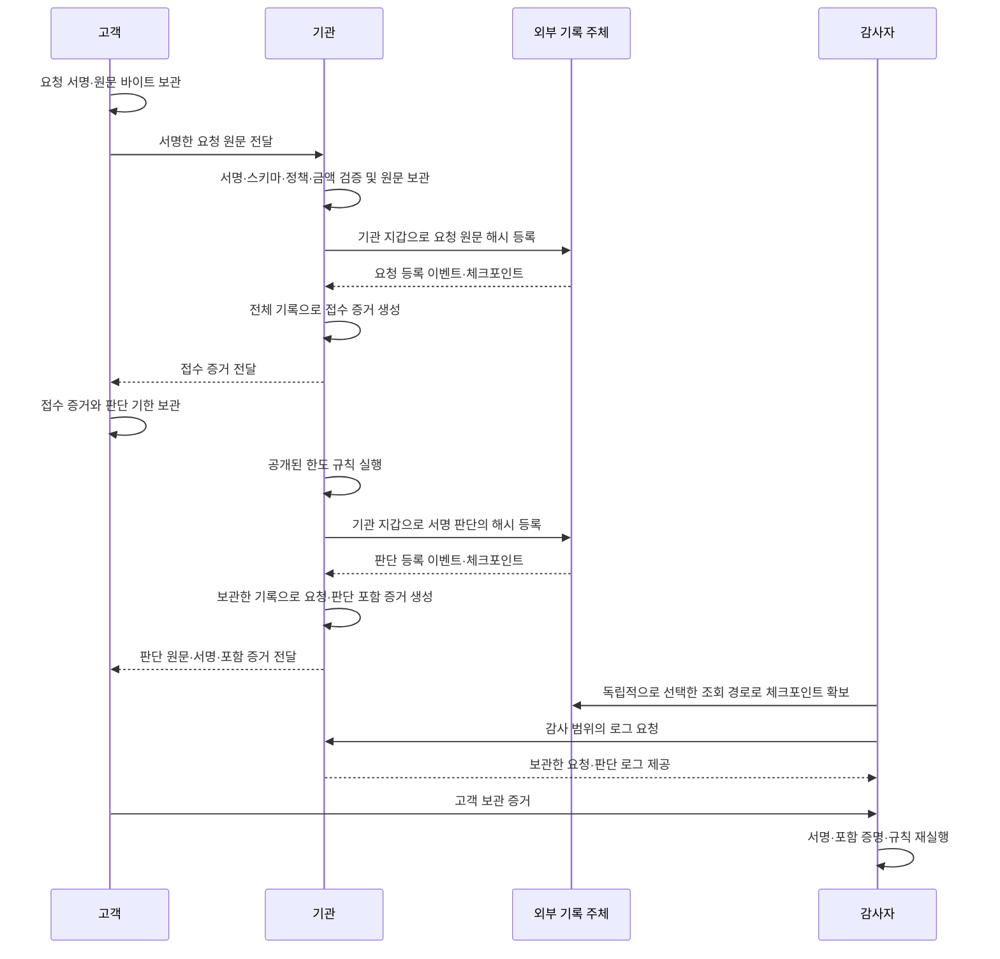

# Trust404 — 거절에도 영수증이 필요하다

150만 원을 송금하려던 고객이 “1회 한도 100만 원 초과”로 거절당했습니다. 돈이 이동하지 않아 송금 내역은 없습니다. 기관이 나중에 거절 이유를 바꾸거나 요청 자체를 지우면, 고객은 무엇으로 사실을 입증할까요?

이 프로토타입은 **요청 접수부터 판단까지 외부 증거를 남기고, 기관 저장소 없이 그 증거를 검증**합니다. 거절 한 건의 진위를 확인하고, 지정된 감사 범위에서 기록 삭제와 미처리 요청을 찾아냅니다.

## Dependency

- Node.js
- Foundry

## Run

1. `contracts/`에서 로컬 ABI·바이트코드를 만듭니다.

```sh
forge build --offline --no-lint --quiet
forge test --offline --quiet
```

2. `anvil`로 로컬 테스트넷을 생성합니다.

3. `anvil`의 rpc url을 `RPC_URL` 환경변수에 지정하여 아래와 같이 실행합니다.

```sh
RPC_URL=http://127.0.0.1:8545 node src/cli.js demo demo-output
# 자동으로 새 출력 경로를 고르는 경우
RPC_URL=http://127.0.0.1:8545 node src/cli.js demo
# 위 명령과 동일한 npm 스크립트
RPC_URL=http://127.0.0.1:8545 npm run demo
```

`RPC_URL`을 이미 환경변수로 설정했다면 `node src/cli.js demo`만 실행해도 됩니다. 출력 경로를 생략하면 `demo-output-<시각>` 디렉터리를 생성합니다. 초기 모의 시연과 달리 실제 계약에 등록하므로, `RPC_URL`이 없으면 `RPC_URL_REQUIRED`로 종료합니다.

4. 오프라인 검증과 시연

- `demo`는 150만 원 거절과 50만 원 승인을 만들고, 판단 전에 접수 증거를 저장합니다.
- 접수 후 판단을 남기지 않은 `unanswered` 요청의 기한 경과와, 다른 150만 원 요청을 잘못 승인한 정책 위반 판단을 오프라인으로 시연합니다. 아래 명령은 RPC와 기관 파일을 읽지 않습니다. 

```sh
# 요청의 접수 증거 검증
node src/cli.js receipt demo-output/customer/receipt.json demo-output/customer/receipt-verification-context.json
# 거절 판단 검증
node src/cli.js verify demo-output/customer/rejection.json demo-output/customer/rejection-verification-context.json
# 승인 판단 검증
node src/cli.js verify demo-output/customer/approval.json demo-output/customer/approval-verification-context.json
# 감사 범위의 전체 기록 검증
node src/cli.js audit demo-output/auditor/submission.json demo-output/auditor/verification-context.json

# 다음 공격 파일은 오류 또는 미처리 탐지로 종료 코드 1 기대
# 판단 사유 변조 탐지
node src/cli.js verify demo-output/attacks/tampered.json demo-output/customer/rejection-verification-context.json
# 서명 변조 탐지
node src/cli.js verify demo-output/attacks/forged-signature.json demo-output/customer/rejection-verification-context.json
# 기록 삭제 탐지
node src/cli.js audit demo-output/attacks/deleted-log.json demo-output/auditor/verification-context.json
# 판단 기한이 지난 미처리 요청 탐지
node src/cli.js audit demo-output/attacks/missing-log.json demo-output/attacks/missing-verification-context.json
# 정책에 어긋난 승인 판단 탐지
node src/cli.js verify demo-output/attacks/wrong-policy-result.json demo-output/attacks/wrong-policy-verification-context.json
```

데모는 정상 3개와 공격 5개를 자동 검사합니다. 정상·미처리·정책 위반 사례는 같은 계약에서 각각 확보한 감사 범위를 사용합니다.

## Test

1. 저장소 루트에서 오프라인 테스트를 실행합니다. `npm test`는 아래 세 파일만 실행하며 계약 vendor 테스트를 탐색하지 않습니다.

```sh
npm test
```

2. 다음 명령은 `scripts/test-anvil.js`로 계약을 오프라인 빌드한 뒤, **실제 Anvil 프로세스를 시작하여 통합 테스트를 실행하고 종료**합니다. Anvil은 빈 로컬 포트를 사용하며 `RPC_URL` 설정이나 기존 노드 준비가 필요하지 않습니다.

```sh
npm run test:anvil
```

JS 스크립트를 직접 실행할 수도 있습니다.

```sh
node scripts/test-anvil.js
```

비기관 등록 거부, 기관 접수·판단, 별도 provider를 통한 체크포인트 조회, 기한 경계와 과거 감사 범위 보존을 실제 계약에서 검사합니다. 성공 시 종료 코드는 0, 빌드나 테스트 실패 시 0이 아닌 값을 반환하며 임시 테스트 파일은 정리합니다.

### 주요 출력 파일

| 경로 | 내용 |
| --- | --- |
| `context.json`, `auditor/context.json` | 체인 ID, `evidenceLogAddress`, 배포 블록, 깊이, 기관 주소 |
| `customer/receipt.json`, `customer/receipt-verification-context.json` | 판단 전 접수 증거와 그 범위의 검증 입력 |
| `customer/rejection.json`, `customer/rejection-verification-context.json` | 기관이 반환한 거절 판단 증거와 해당 체크포인트의 검증 입력 |
| `customer/approval.json`, `customer/approval-verification-context.json` | 기관이 반환한 승인 판단 증거와 해당 체크포인트의 검증 입력 |
| `institution/full-log.json` | 기관이 보관하는 전체 요청·판단 기록 |
| `institution/decisions.json` | 기관이 보관하는 판단 목록 |
| `auditor/submission.json` | 지정 체크포인트 범위로 기관이 제출한 로그 사본 |
| `auditor/verification-context.json` | 체인·계약 정보, 별도 provider로 확보한 감사 체크포인트, 정책과 고객·기관 공개키 |
| `witness/checkpoint.json` | 외부 기록 주체에서 독립 조회한 감사 체크포인트 |
| `attacks/tampered.json`, `attacks/forged-signature.json`, `attacks/deleted-log.json` | 사유 변경, 서명 위조, 감사 목록 삭제 사례 |
| `attacks/missing-log.json`, `attacks/missing-verification-context.json` | 접수 후 판단 미처리를 확인하는 전체 기록과 기한 경과 시점의 검증 입력 |
| `attacks/wrong-policy-result.json`, `attacks/wrong-policy-verification-context.json` | 정책 위반 판단의 증거와 그 판단을 포함하는 감사 범위의 검증 입력 |

등록 전 보관하는 요청·판단 원문 파일도 함께 생성합니다. 원문 바이트는 hex, EVM `bigint`는 10진 문자열로 저장합니다. 개인키는 파일에 저장하지 않습니다.

## 증거가 만들어지는 과정



## 무엇을 보장하는가

| 평가 항목 | 검증 근거 | 한계 |
| --- | --- | --- |
| 불변성 | 원문 서명, 추가 전용 계약 기록과 사전 고정 Merkle 루트 | 로컬 사본 변조는 탐지; 체인의 확정 기준은 별도로 필요 |
| 완전성 | 감사 범위의 크기·루트, 접수와 판단의 대조 | 외부에 접수되지 않은 요청은 탐지 불가 |
| 독립 검증 | 별도로 확보한 공개키와 체크포인트 | 그 기준의 안전한 전달을 가정 |
| 부인 방지 | 고객의 요청 서명과 기관의 판단 서명 | 키 소유·보호를 가정; 고객의 판단 동의는 의미하지 않음 |
| 사유 검증 | 서명된 입력과 정책으로 판단 재실행 | 현실 입력의 진실성이나 숨은 동기는 증명하지 않음 |

## 참고와 문서

- [시나리오](SCENARIO.md), [요구사항·증거 스키마](REQUIREMENTS.md), [테스트 스위트](TEST-SUITE.md), [검증 기록](VALIDATION.md), [용어](CONTEXT.md)
- [Tessera](../reference-projects/tessera/README.md): 추가 전용 Merkle 로그, 순번, 체크포인트 아이디어를 참고했습니다.
- [daryl의 서명 기본 요소](../reference-projects/daryl/packages/dsm-primitives/README.md): 정규 직렬화·해시·서명 분리를 참고했습니다. 바이트 포맷 호환 구현은 아닙니다.
- [Linera](../reference-projects/linera-protocol/README.md): 외부 체인 앵커 후보를 검토했으나 이번 로컬 시연에는 연동하지 않았습니다.
