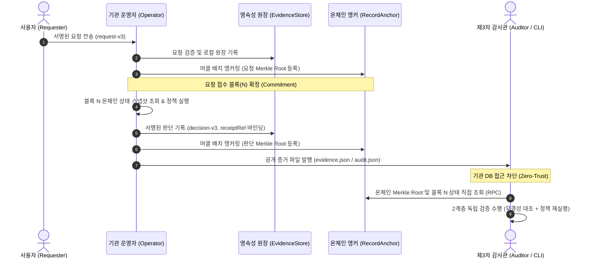
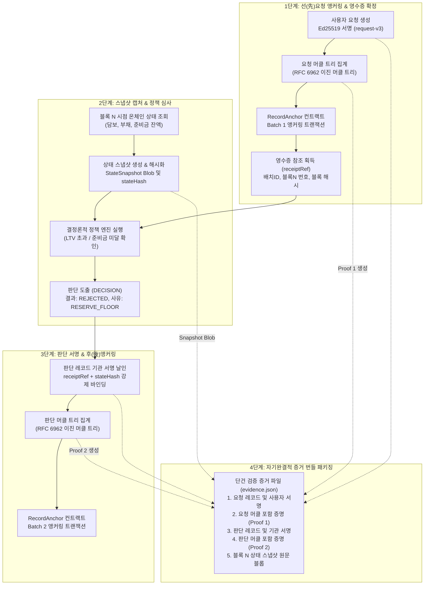
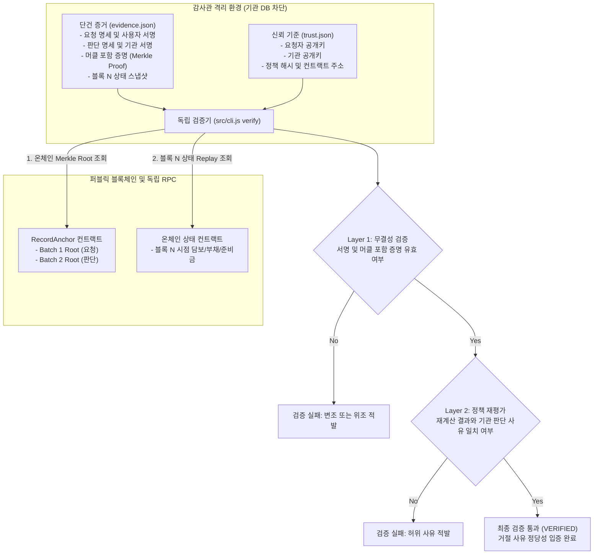
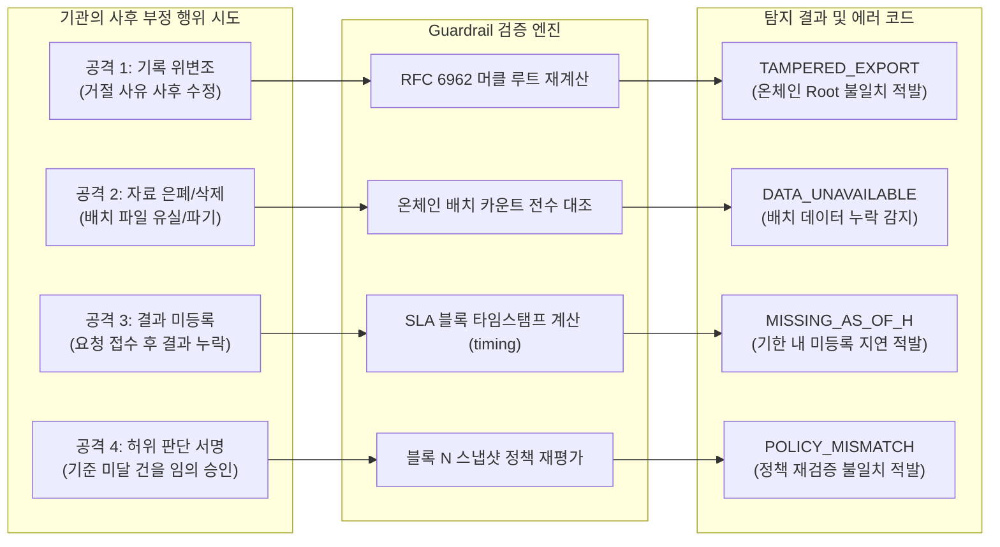

# Guardrail: 검증 가능한 오프체인 의사결정 감사 인프라 (Verifiable Rejections)

> **"승인된 송금 내역만 블록체인에 남는 세상에서, 보이지 않는 곳에서 거절당한 판단은 어떻게 신뢰할 수 있을까요?"**  
> **Guardrail**은 금융기관 및 Web3 프로토콜의 오프체인 심사 판단(승인/거절)을 **기관 내부 데이터베이스나 서버를 전혀 신뢰하지 않고도, 누구나 온체인 앵커와 공개키만으로 독립 검증할 수 있는 무신뢰(Zero-Trust) 감사 인프라**입니다.

---

## 1. 문제 배경 및 정의 (Problem Background & Definition)

### 1) 누가 겪는 실재하는 문제인가 (Target Stakeholders)
- **대출 및 금융 서비스 신청자 (소외 계층, 개인, 중소기업)**:  
  대출이나 한도 승인이 거절되었을 때, 기관으로부터 단순 텍스트 안내만 받을 뿐 "실제 규정에 맞게 공정하게 평가되었는지", "기관이 자의적 담합이나 차별로 부당하게 거절한 것은 아닌지"를 입증할 방법이 없습니다.
- **금융 규제 기관 및 컴플라이언스 감사관**:  
  사후 감사를 수행하려 해도 기관이 제공하는 내부 데이터베이스 로그에 전적으로 의존해야 합니다. 피감기관이 사후에 로그를 조작하거나 선별적으로 누락하여 제출하더라도 이를 적발할 객관적 기준선이 없습니다.
- **탈중앙화 금융(DeFi) 및 자율 에이전트 프로토콜**:  
  오프체인 리스크 엔진이나 AI 에이전트가 담보 부족 등의 사유로 청산/거절 결정을 내렸을 때, 그 결정이 온체인 프로토콜 정책을 엄격히 준수했는지 증명할 암호학적 영수증이 부재합니다.

### 2) 기존 오프체인 심사의 구조적 결함
- **거절(Rejection)의 블랙박스화**: 승인된 거래는 온체인 송금 트랜잭션으로 남아 영구 증빙되지만, **거절된 거래는 온체인 상태 변화를 일으키지 않으므로 흔적 없이 증발**합니다.
- **감사 대상과 증거 보관 주체의 일치**: 금융기관 내부 DB가 유일한 진실의 원천(Single Source of Truth)이 되는 구조적 모순(Fox guarding the henhouse)으로 인해, 사후 은폐와 위변조가 원천적으로 가능합니다.

---

## 2. 해결 방안 (Solution: Guardrail)

Guardrail은 오프체인 의사결정의 신뢰 문제를 해결하기 위해 다음 3대 핵심 메커니즘을 결합합니다:

1. **선(先)요청 앵커링 (Commitment-First Protocol)**:  
   기관이 승인/거절 판단을 내리기 전에, 접수된 사용자 요청을 머클 배치로 묶어 온체인(`RecordAnchor.sol`)에 먼저 등록합니다. 이를 통해 기관이 불리한 요청을 사후에 삭제하거나 은폐(Censorship)하는 행위를 원천 차단합니다.
2. **2계층 독립 검증 (2-Layer Verification)**:  
   - **Layer 1 (기록 무결성)**: Ed25519 전자서명과 RFC 6962 머클 감사 경로를 대조하여 원문의 위변조 및 누락을 수학적으로 증명합니다.
   - **Layer 2 (결정론적 정책 재평가)**: 요청 접수 블록(N) 시점의 온체인 상태(담보, 부채, 준비금) 스냅샷을 고정하고, 제3자 검증기가 동일한 규칙으로 정책을 직접 재실행하여 기관이 서명한 거절 사유가 진실인지 검증합니다.
3. **Zero-Trust DB 검증**:  
   기관 내부 DB에 대한 읽기 권한을 완전히 차단한 상태에서도, 오직 공개된 단건 증거(`evidence.json`)와 온체인 RPC 정보만으로 완전한 제3자 감사를 종결합니다.

---

## 3. 코어 아키텍처 및 동작 흐름 (Core Architecture & Flow)

Guardrail의 전체 라이프사이클은 **요청 접수 → 선 앵커링 → 스냅샷 기반 판단 → 후 앵커링 → 독립 검증**의 파이프라인으로 동작합니다.



### 단계별 상세 설명
1. **요청 접수 및 서명**: 사용자는 요청 명세에 본인의 Ed25519 개인키로 서명(`request-v3`)하여 전송합니다.
2. **배치 구성 및 요청 앵커링**: 기관은 수집된 요청들을 RFC 6962 머클 트리로 집계하여 `RecordAnchor` 컨트랙트에 Merkle Root를 기록합니다. 이 트랜잭션이 포함된 블록(N)이 감사의 기준 시점이 됩니다.
3. **상태 스냅샷 및 정책 평가**: 기관은 블록 N 시점의 온체인 상태(차입자 담보/부채, 기관 지급 준비금)를 스냅샷으로 추출하고 정책 엔진을 실행하여 승인 또는 거절 결정을 내립니다.
4. **판단 앵커링 및 바인딩**: 기관은 결정문(`decision-v3`)에 요청이 앵커링된 배치 정보(`receiptRef`)와 당시 `stateHash`를 포함하여 서명하고, 이를 다시 온체인에 앵커링합니다.
5. **공개 증거 발행**: 기관은 사용자에게 개별 검증 영수증(`evidence.json`)을 발급하고, 감사관에게는 배치 전체 아카이브(`audit.json`)를 공개합니다.

---

## 4. 오프체인 판단 및 검증 가능한 증거 생성 흐름 (Verifiable Evidence Generation Flow)

금융기관이 접수된 요청을 심사하여 거절(또는 승인) 판단을 내리고, 이를 외부 감사관이 독립 검증할 수 있는 **자기완결적 단건 증거 번들(`evidence.json`)**로 조립(Assemble)하는 상세 데이터 파이프라인입니다.



### 증거 생성 파이프라인의 핵심 불변식 (Invariants)
1. **원천 요청의 선(先) 확정**: 판단이 내려지기 전, 사용자 요청이 먼저 온체인(Batch 1)에 영구 기록되어 고유한 `receiptRef`(배치 ID, 인덱스, 블록 번호, 블록 해시)가 발급됩니다. 기관은 접수된 요청을 임의로 누락하거나 사후에 교체할 수 없습니다.
2. **동일 시점 온체인 상태 바인딩**: 블록 N 시점의 온체인 상태 스냅샷에 대한 해시값(`stateHash`)이 기관의 판단문(`decision-v3`) 내부에 불변으로 포함되어 서명됩니다. 따라서 기관이 사후에 변경된 상태를 핑계로 거짓 사유를 둘러댈 수 없습니다.
3. **독립적 증명력의 완결성 (Self-Contained Bundle)**: 생성된 `evidence.json` 파일에는 두 건의 머클 포함 증명(요청용, 판단용)과 당시 상태 블롭이 함께 포함되어 있어, 수신자는 기관 DB 접근 없이 오직 퍼블릭 RPC와 신뢰 프로필(`trust.json`)만으로 진위를 100% 검증할 수 있습니다.

---

## 5. 무신뢰 단건 거절 검증 흐름 (Zero-Trust Single Verification Flow)

외부 감사관이나 사용자가 기관의 서버나 DB에 일절 접속하지 않고, 오직 자신에게 전달된 영수증과 퍼블릭 블록체인만으로 1건의 거절을 독립 검증하는 과정입니다.



### 무신뢰 단건 검증의 동작 원리
- **기관 DB 접속 불필요**: 검증기는 기관의 데이터베이스나 내부 API를 호출하지 않으며, 오직 공개된 RPC 노드를 통해 체인 데이터만 읽습니다.
- **양방향 암호학적 바인딩**: 판단문 내부의 `receiptRef`가 요청 배치의 온체인 위치(배치 ID, 블록 번호, 블록 해시)를 직접 가리키고 있으므로, 기관이 사후에 다른 요청으로 바꿔치기할 수 없습니다.
- **독립 재실행(Replay)**: 기관이 제시한 거절 사유를 그대로 믿는 것이 아니라, 블록 N 시점의 온체인 수치를 기반으로 검증기가 직접 수식을 계산하여 일치 여부를 대조합니다.

---

## 6. 사후 조작·삭제·누락 탐지 흐름 (Tampering, Deletion & Omission Detection Flow)

악의적인 기관이 사후에 특정 기록을 위변조하거나, 불리한 요청을 은폐/삭제하거나, 결과를 고의로 누락했을 때 시스템이 이를 적발하는 매커니즘입니다.



1. **기록 변조 시도 (`TAMPERED_EXPORT`)**: 기관이 파일 내용 중 1글자라도 변경하면 머클 리프 해시가 바뀌고, 최종 재계산된 루트가 온체인에 영구 기록된 머클 루트와 달라져 즉각 적발됩니다.
2. **자료 은폐 및 삭제 시도 (`DATA_UNAVAILABLE`)**: 기관이 불리한 배치를 은폐하고 전달하지 않으면, 온체인 컨트랙트에 기록된 배치 수(`count`)와 실제 제출된 배치 수가 일치하지 않아 감사가 성립하지 않습니다.
3. **결과 미등록 시도 (`MISSING_AS_OF_H`)**: 요청을 온체인에 등록한 후 약정 기한(예: 90초) 내에 후속 판단 배치를 등록하지 않으면, 시간 경과를 온체인 타임스탬프로 대조하여 지연/누락으로 판정합니다.
4. **허위 판단 및 담합 시도 (`POLICY_MISMATCH`)**: 기관이 정당한 사유 없이 임의로 서명하더라도, 검증기가 블록 N 당시 온체인 상태로 정책을 직접 재실행하므로 기관 서명의 허위성이 즉시 탄로납니다.

---

## 7. 4대 보안 원칙 구현 실증 및 코드 위치 (Core Guarantees)

Guardrail은 시스템 소프트웨어 및 암호학의 4대 보안 원칙을 충족하도록 구현되었으며, 모든 항목은 자동화된 테스트 코드로 검증됩니다.

| 보안 원칙 | 충족 요건 및 보장 방식 | 구현 코드 위치 | 검증 테스트 코드 |
| :--- | :--- | :--- | :--- |
| **불변성<br>(Immutability)** | • 온체인에 등록된 머클 루트는 컨트랙트에서 덮어쓰기(`revert`)가 원천 금지됨.<br>• 오프체인 파일 수정 시 온체인 루트와 불일치 적발. | • [`contracts/RecordAnchor.sol`](file:///Users/kimh4nkyul/hackathon/trust404/track3/contracts/RecordAnchor.sol)<br>• [`src/common/merkle.js`](file:///Users/kimh4nkyul/hackathon/trust404/track3/src/common/merkle.js)<br>• [`src/verifier/verify.js`](file:///Users/kimh4nkyul/hackathon/trust404/track3/src/verifier/verify.js) | • `contracts/test/RecordAnchor.t.sol`<br>• `test/unit/core.test.js`<br>(리프/인덱스 변조 감지) |
| **완전성<br>(Completeness)** | • 감사 기준 블록까지 등록된 배치 수와 원문 배치를 전수 대조.<br>• 등록 후 판단 누락이나 SLA 기한 초과를 정확히 탐지. | • [`src/verifier/verify.js:auditAll`](file:///Users/kimh4nkyul/hackathon/trust404/track3/src/verifier/verify.js)<br>• [`src/verifier/verify.js:timing`](file:///Users/kimh4nkyul/hackathon/trust404/track3/src/verifier/verify.js) | • `test/unit/core.test.js`<br>• `test/integration/demo.test.js`<br>(자료 유실 및 미등록 탐지) |
| **독립 검증 가능성<br>(Independent Verifiability)** | • 기관 DB 읽기 권한을 OS 수준(`--permission`)에서 차단해도 공개 증거와 체인 RPC만으로 검증 가능. | • [`src/cli.js`](file:///Users/kimh4nkyul/hackathon/trust404/track3/src/cli.js)<br>• [`demo/aim.js`](file:///Users/kimh4nkyul/hackathon/trust404/track3/demo/aim.js) | • `test/integration/aim.test.js`<br>(Node.js OS 격리 검증 PASS) |
| **부인 방지<br>(Non-Repudiation)** | • 요청자와 기관이 서로 다른 Ed25519 키로 정규 엔벨로프에 서명.<br>• 도메인 분리(`request-v3`, `decision-v3`)를 통해 서명 교차 재사용 방지. | • [`src/common/crypto.js:sign`](file:///Users/kimh4nkyul/hackathon/trust404/track3/src/common/crypto.js)<br>• [`src/common/crypto.js:verifySignature`](file:///Users/kimh4nkyul/hackathon/trust404/track3/src/common/crypto.js)<br>• [`src/policy/policy.js`](file:///Users/kimh4nkyul/hackathon/trust404/track3/src/policy/policy.js) | • `test/unit/core.test.js`<br>(서명 위조 및 불일치 감지) |

---

## 8. 보안적 타당성 및 위협 모델 (Security Model & Threat Boundaries)

### 1) 방어하는 위협 모델 (Threats Mitigated)
- **사후 위변조 (Post-decision Tampering)**: 기관이 감사 시점에 유리하도록 과거 거절 사유나 승인 내역을 조작하는 위협 ➜ 온체인 Merkle Root 대조로 방어.
- **선별적 증거 인멸 (Selective Data Omission)**: 부당하게 거절된 특정 고객의 기록만 삭제하는 위협 ➜ 선(先)요청 앵커링 및 배치 카운트 전수 대조로 방어.
- **자의적/담합 판단 (Arbitrary Decision-Making)**: 내부 담합이나 차별로 인해 규정상 승인되어야 할 대출을 거절하는 위협 ➜ 블록 시점 상태 재현 및 결정론적 정책 재평가로 방어.
- **파싱 차이 공격 (Parser Differential Exploits)**: JSON 키 순서나 유니코드 인코딩 차이를 이용한 서명 우회 위협 ➜ RFC 8785 (JCS) 엄격 정규화로 방어.

### 2) 시스템의 정직한 신뢰 경계 (Security Boundaries & Assumptions)
- **최초 등록 전 숨긴 요청 (Pre-commit Censorship)**:  
  사용자가 웹으로 요청을 전송했으나, 악의적인 기관이 온체인에 등록(Commit)하기 전에 로컬 메모리에서 즉시 삭제해 버린 경우, 온체인 로그 자체에 요청이 존재하지 않으므로 외부 제3자 감사관은 체인 정보만으로 이를 적발할 수 없습니다. (단, 요청자가 본인이 서명한 영수증을 소지한 경우 개별 입증 가능).
- **키 관리와 신원 바인딩**:  
  현재 시연 환경은 역할별 모의 키를 사용하므로, 실제 프로덕션 도입 시에는 사용자의 자체 보관 지갑(Self-custody) 및 기관의 HSM(하드웨어 보안 모듈) 기반 서명 인프라가 전제되어야 합니다.

---

## 9. 빠른 시작 및 테스트 가이드 (Quickstart)

### 1) 사전 설치 요구사항 (Prerequisites)

프로젝트 빌드 및 로컬 체인 시연을 위해 아래 도구가 반드시 설치되어 있어야 합니다:

- **Node.js (>= 22.22.2)**: 내장 `node:sqlite` 및 ES 모듈 런타임에 필요합니다.
  ```bash
  node -v  # v22.22.2 이상 확인
  ```
- **Foundry 툴체인 (`forge`, `anvil`)**:
  - **`forge`**: Solidity 스마트 컨트랙트(`RecordAnchor.sol`, `CreditState.sol`) 컴파일 및 컨트랙트 단위 테스트에 필요합니다.
  - **`anvil`**: 로컬 웹 데모(`npm run demo:local`) 및 통합 테스트(`npm run test:integration`) 실행 시 격리된 로컬 블록체인 노드를 백그라운드에서 자동으로 스폰(Spawn)하는 데 필수적입니다.
  - **설치 방법 (macOS / Linux / WSL2)**:
    ```bash
    curl -L https://foundry.sh | bash
    foundryup
    ```
  - **설치 확인**:
    ```bash
    forge --version
    anvil --version
    ```

### 2) 저장소 복제 및 컨트랙트 컴파일
```bash
git clone https://github.com/tetherkim/trust404.git
cd trust404
npm ci
forge build
```

### 3) 대화형 웹 감사 콘솔 시연 (가장 권장)
```bash
npm run demo:local
# 또는 npm run demo
```
- 브라우저에서 `http://127.0.0.1:4040` 접속 후 5대 시나리오 샘플 파일을 드래그 앤 드롭하여 즉시 검증.

### 4) 기술 감사관용 무신뢰 격리 검증 시연
```bash
npm run demo:aim
```
- OS 수준 DB 차단 환경에서의 4대 공격 적발 터미널 시연.

### 5) 전체 테스트 스위트 검증 (38개 테스트 100% PASS)
```bash
npm test && npm run test:contracts && npm run test:integration
```

### 6) 환경변수(.env) 기반 확장 기능 실행 가이드

`.env` 설정은 **기관 운영자 데몬(`operator`)** 및 **대출 신청 웹 포털(`serve`)**을 구동할 때 필요합니다. (위의 감사 콘솔 `demo:local` 및 격리 검증 `demo:aim`은 `.env` 없이 즉시 실행됩니다.)

#### 1단계: .env 파일 생성 및 접속 코드 설정
```bash
cp .env.example .env
```
`.env` 파일을 열고 `DEMO_ACCESS_CODE`에 24자 이상의 임의 문자열을 입력합니다:
```bash
# 24자 이상 난수 생성 예시
node -e "console.log(require('node:crypto').randomBytes(32).toString('hex'))"
```

#### 2단계: 기관 운영자 데몬 실행 (`npm run operator`)
운영자 전용 지갑 초기화, 컨트랙트 배포, Aomi Agent 연동 배치 앵커링을 단계별로 수행합니다:
```bash
# 운영자 전용 지갑 초기화 (로컬 전용 시연 키 생성)
npm run operator -- init

# 운영자 상태 확인 및 RecordAnchor 컨트랙트 배포
npm run operator -- status
npm run operator -- deploy

# Aomi Agent 연동 대출 요청 및 배치 앵커링 제출 (예: 50 USDC 요청, 중복방지키 demo-1)
npm run operator -- aomi-submit 50000000 demo-1
```
성공 시 `.local-demo/hosted/operator/exports/demo-1/` 경로에 `evidence.json`, `audit.json` 등 독립 검증용 증거 파일이 자동 생성됩니다.

#### 3단계: 대출 신청 및 영속 큐 웹 포털 구동 (`npm run serve`)
사용자가 웹 UI에서 대출을 신청하고, 백그라운드 큐(`jobs.sqlite`)를 통해 온체인 배치 앵커링 및 증거 다운로드를 제공하는 풀스택 서비스입니다:
```bash
npm run serve
```
1. 브라우저에서 `http://127.0.0.1:8080`에 접속합니다.
2. `.env`에 지정한 `DEMO_ACCESS_CODE`를 입력하여 로그인합니다.
3. 원하는 대출 금액을 입력하고 신청을 제출하면 백그라운드 워커가 순차 처리합니다.
4. 처리가 완료되면 테이블에서 `단건 증거 (evidence.json)`, `전체 감사 파일 (audit.json)` 등 6종의 증거 자료를 다운로드하여 감사에 활용할 수 있습니다.

---

## 10. 그외 문서

- **[코어 아키텍처 상세 명세서 (src/README.md)](src/README.md)**: 모듈별 책임, RFC 규격, 에러 코드 매트릭스
- **[시연 및 데모 런북 (demo/README.md)](demo/README.md)**: 5대 시나리오 검증 매트릭스 및 상세 실행 안내

---

## 11. 부록 (Appendix)

### 1) 디렉터리 및 모듈 구조 상세

본 프로젝트의 전체 디렉터리 구조와 역할별 모듈 명세는 다음과 같습니다.

#### (1) 전체 디렉터리 맵

```
track3/
├── contracts/               # 온체인 스마트 컨트랙트 (Solidity & Foundry)
│   ├── CreditState.sol      # 차입자 담보(collateral) 및 부채(debt) 상태 관리 컨트랙트
│   ├── RecordAnchor.sol     # 오프체인 머클 배치 루트(root)를 앵커링하는 불변 컨트랙트
│   └── test/                # 컨트랙트 단위 및 퍼징 테스트 (Foundry)
│       ├── CreditState.t.sol
│       └── RecordAnchor.t.sol
├── demo/                    # 시연 및 독립 감사관 환경
│   ├── local.js             # Anvil 기반 5대 시나리오 자동 구성 및 시연 엔진
│   ├── aim.js               # OS 파일시스템 권한 차단 환경에서의 무신뢰 독립 검증 시연
│   ├── audit-server.js      # 감사관 독립 웹 감사 서버
│   ├── audit-file.js        # 감사 파일 무결성 및 배치 감사 실행기
│   ├── index.html / ui.js   # 브라우저 기반 대화형 감사 콘솔 UI
│   ├── portal/              # 대출 신청 및 영속 큐 풀스택 웹 포털
│   │   ├── server.js        # 접근 코드 인증 및 SQLite 작업 큐 서버
│   │   ├── portal.html      # 사용자 대출 신청 포털 웹 UI
│   │   └── portal.js        # 증거 파일 6종 다운로드 및 프론트엔드 비즈니스 로직
│   ├── testnet.js / ui.js   # Base Sepolia 테스트넷 수동 시연 도구
│   └── README.md            # 시연 및 데모 상세 런북
├── src/                     # 시스템 코어 소스코드 (역할별 모듈 분리)
│   ├── common/              # [공통] 암호화 원천, 머클트리, RPC, 컨트랙트 ABI
│   │   ├── crypto.js        # JCS(RFC 8785) 정규화, SHA-256, Ed25519 서명/검증
│   │   ├── merkle.js        # RFC 6962 표준 머클트리 빌더 및 감사 경로 검증
│   │   ├── rpc.js           # 경량 JSON-RPC 2.0 클라이언트 및 수량 포맷터
│   │   ├── abi.js           # RecordAnchor, CreditState 컨트랙트 ABI 정의
│   │   └── index.js         # common 모듈 배럴 export
│   ├── policy/              # [비즈니스 정책] 대출 심사 규칙 및 상태 스냅샷
│   │   └── policy.js        # USDC 준비금 정책, LTV 정책, 상태 스냅샷, 결정 생성
│   ├── verifier/            # [독립 검증기] 제3자 검증 및 전수 감사 엔진
│   │   ├── verify.js        # 단건 검증(verifyOne), 전수 감사(auditAll), SLA 타이밍
│   │   └── finality.js      # 감사 기준 체인 확정(Finalized) 블록 판별기
│   ├── chain/               # [블록체인 연동] 상태 조회 및 RPC 런타임
│   │   ├── reader.js        # ChainReader / ChainView (블록 뷰 고정 및 리오그 방어)
│   │   └── rpc-runtime.js   # 과거 블록 상태 재생(Replay) 및 로컬 시뮬레이션 어댑터
│   ├── storage/             # [영속성 계층] 로컬 DB 및 증거 아카이브
│   │   └── store.js         # EvidenceStore (SQLite WAL), Archive (불변 파일 저장소)
│   ├── server/              # [서비스 계층] 기관 내부 증거 관리 HTTP API
│   │   └── server.js        # 요청 접수, 배치 준비, 의사결정 평가용 내부 HTTP 서비스
│   ├── operator/            # [기관 운영 데몬] 트랜잭션 앵커링 및 Aomi 실행
│   │   ├── run.js           # 오퍼레이터 메인 데몬 (지갑 관리, 배치 앵커링, 저널 복구)
│   │   └── aomi.js          # Aomi SDK/SIWE 세션 관리 및 시뮬레이션 가드 검증
│   ├── cli.js               # 감사관용 독립 커맨드라인 인터페이스 (verify / audit)
│   └── README.md            # 코어 아키텍처 상세 명세서
├── test/                    # 테스트 스위트 (총 38개 테스트)
│   ├── unit/                # 단위 기능 테스트 (20개 PASS)
│   │   ├── core.test.js     # 암호화 원천 및 머클트리 표준 검증
│   │   ├── credit-policy.test.js # LTV 및 준비금 비즈니스 규칙 검증
│   │   ├── store.test.js    # SQLite WAL 및 중복 방지 멱등성 검증
│   │   ├── rpc-runtime.test.js   # 과거 블록 Replay 런타임 검증
│   │   ├── aomi.test.js     # Aomi 트랜잭션 시뮬레이션 가드레일 검증
│   │   ├── server-verification.test.js # 내부 서비스 증거 발급 검증
│   │   ├── state-mutation-demo.test.js # 상태 변조 시나리오 시뮬레이션
│   │   ├── finality.test.js # Finalized 체인 뷰 결정 검증
│   │   ├── local-deploy.test.js # 로컬 배포 프로세스 검증
│   │   └── fixtures.js      # 테스트용 결정론적 키셋 및 픽스처
│   ├── integration/         # 로컬 체인 기반 E2E 통합 테스트 (10개 PASS)
│   │   ├── aim.test.js      # 무신뢰 프로세스 격리 및 기관 DB 차단 검증
│   │   ├── chain.test.js    # HTTP → SQLite → Anvil → RPC 감사 전체 파이프라인
│   │   ├── demo.test.js     # 5대 시나리오 생성 및 웹 감사 API 통합 검증
│   │   ├── hosted.test.js   # 대출 포털 세션 인증 및 영속 큐 복구 검증
│   │   └── operator.test.js # 오퍼레이터 트랜잭션 저널링 및 크래시 복구 검증
│   └── local-process.test.js# 자식 프로세스 수명 주기 및 정리 검증
├── examples/                # 실제 온체인 앵커링 산출물 샘플
│   └── aomi-base-sepolia/   # Base Sepolia에 등록된 실제 공개 감사 패키지
│       ├── trust.json       # 발행자, 컨트랙트 주소, 정책 해시, 신뢰 기준
│       ├── audit.json       # 전체 머클 배치 및 당시 상태 블롭 모음
│       ├── execution.json   # Aomi 세션 ID, 액션 ID, 온체인 트랜잭션 해시 기록
│       ├── audit-result.json# 감사 도구가 검증한 결과 보고서
│       └── profiles.json    # 신뢰 프로필 인덱스
├── scripts/                 # 환경 진단 및 로컬 자동화 스크립트
│   ├── check-aomi.js        # Aomi CLI 및 세션 인증 진단
│   ├── check-base-sepolia.js # Base Sepolia RPC 응답성 진단
│   ├── check-testnet.js     # 공개 테스트넷 RPC 블록 완결성 확인
│   ├── deploy-local.js      # Anvil 로컬 체인 기동 및 기준선 배포
│   └── local-process.js     # 백그라운드 프로세스 안전 종료 유틸리티
├── package.json             # 프로젝트 스크립트 및 의존성 정의
├── foundry.toml             # Foundry 빌드 및 테스트 환경 설정
└── README.md                # Guardrail 프로젝트 메인 기술 문서
```

#### (2) 역할별 핵심 모듈 설계 상세

#### (1) 공통 암호화 계층 (`src/common/`)
- **`crypto.js`**:
  - `canonical(value)`: RFC 8785 (JSON Canonicalization Scheme) 준수. 키 정렬과 공백 제거를 통해 결정론적 바이트열을 도출하며, 인코딩 차이로 인한 변조 여지를 차단합니다.
  - `parseWire(text)`: 수신된 JSON 텍스트가 정규화된 형태와 1바이트라도 다를 경우 `NON_CANONICAL_WIRE` 예외를 발생시켜 인코딩 변조 공격을 방어합니다.
  - `sign(domain, keyId, payload, privateKey)` & `verifySignature(...)`: Ed25519 비대칭키 기반 도메인 분리 서명 엔벨로프를 생성하고 검증합니다.
- **`merkle.js`**:
  - `buildTree(records)`: RFC 6962 표준(Leaf 접두사 `0x00`, Branch 접두사 `0x01`, 2의 거듭제곱 분기)을 준수하는 이진 머클 트리를 생성하고 루트 해시를 산출합니다.
  - `verifyProof(record, index, count, proof, expectedRoot)`: 머클 감사 경로(Inclusion Proof)를 검증하여 해당 레코드가 온체인 루트에 정확히 포함되었음을 수학적으로 증명합니다.
- **`rpc.js`**:
  - `jsonRpc(url, options)`: 타임아웃 및 스키마 검증을 내장한 경량 표준 JSON-RPC 2.0 클라이언트입니다.
  - `quantity(value)`: BigInt 및 숫자를 Ethereum RPC 16진수 수량 규격(`0x...`)으로 포맷팅합니다.

#### (2) 비즈니스 정책 계층 (`src/policy/`)
- **`policy.js`**:
  - `evaluate(...)`: USDC 준비금 정책(`usdc-reserve-v1`)에 따라 한도 초과(`LIMIT_EXCEEDED`) 및 최소 잔액 미달(`RESERVE_FLOOR`) 여부를 엄밀히 판정합니다.
  - `evaluatePolicy(...)`: 신용 LTV 정책(`credit-ltv-v1`)에 따라 차입자의 담보와 부채, 신청액을 기준으로 사후 LTV를 산출하고 초과(`LTV_EXCEEDED`) 여부를 판정합니다.
  - `makeDecision(...)`: 요청 시점의 온체인 블록 상태를 스냅샷으로 캡처하고, 정책에 따른 판단 레코드(`DECISION`)를 생성하여 기관 서명을 날인합니다.
  - `validateDecision(...)`: 저장된 판단 레코드의 결론이 당시 상태 스냅샷 및 정책 규칙과 정확히 일치하는지 사후 재검증합니다.

#### (3) 독립 검증 계층 (`src/verifier/`)
- **`verify.js`**:
  - `verifyOne(bundle, trust, chain, runtime)`: 단 1건의 증거 번들(요청, 판단, 상태 스냅샷)을 검증합니다. 요청자/기관 서명 유효성, 온체인 머클 루트 포함 증명, 해당 블록 시점 상태 재현(Replay)을 종합 대조합니다.
  - `auditAll(archive, trust, chain)`: 온체인에 등록된 모든 배치 로그를 전수 조사하여 위변조(`TAMPERED_EXPORT`), 자료 유실(`DATA_UNAVAILABLE`), 미등록(`MISSING_AS_OF_H`), 지연 등록(`REGISTERED_LATE`), 허위 판단(`POLICY_MISMATCH`)을 탐지합니다.
- **`finality.js`**:
  - `auditView(reader)`: 온체인 블록의 완결성을 검사하여 감사 기준 블록이 충분히 확정되었는지(`FINALIZED`), 아니면 재정렬 가능성이 있는 최신 블록(`PROVISIONAL`)인지 구분합니다.

#### (4) 블록체인 연동 계층 (`src/chain/`)
- **`reader.js`**:
  - `ChainReader` / `ChainView`: 특정 블록 해시에 뷰를 고정(Pin)하여 체인 재정렬(Reorg) 공격을 방어하면서 `RecordAnchor` 및 상태 컨트랙트를 안전하게 조회합니다.
  - `anchorCall(...)`: 머클 루트를 컨트랙트에 기록하기 위한 `anchorBatch` 트랜잭션 calldata를 생성합니다.
- **`rpc-runtime.js`**:
  - `RpcRuntimeAdapter`: 과거 특정 블록 높이에서의 온체인 상태를 오차 없이 재현하고, 로컬 Anvil 환경에서 트랜잭션을 사전 시뮬레이션 및 브로드캐스트합니다.

#### (5) 영속성 및 저장소 계층 (`src/storage/`)
- **`store.js`**:
  - `EvidenceStore`: SQLite WAL 모드 기반으로 동작하며, 중복 요청 방지(멱등성 보장), 미등록 레코드의 머클 배치 집계 및 동결(Freezing)을 트랜잭션 단위로 관리합니다.
  - `Archive`: 제3자 감사관에게 전달할 공용 배치 파일(`batch-<id>.json`)과 상태 블롭(`blob-<hash>.json`)을 불변으로 저장하고 충돌을 방지합니다.

#### (6) 기관 운영자 계층 (`src/operator/`)
- **`run.js`**:
  - 기관의 지갑 및 키 초기화, 컨트랙트 배포, 미처리 요청의 온체인 앵커링 주기(`cycle`), 크래시 발생 시 트랜잭션 저널 복구(`transact`)를 수행하는 독립 데몬입니다.
- **`aomi.js`**:
  - `@aomi-labs/client` SDK를 통해 SIWE 세션을 맺고, Aomi 트랜잭션 시뮬레이션 결과 및 가드레일을 검증하여 안전한 배치 트랜잭션만 실행되도록 통제합니다.

#### (7) 스마트 컨트랙트 (`contracts/`)
- **`RecordAnchor.sol`**:
  - 오프체인 머클 배치를 온체인에 등록하는 앵커 컨트랙트입니다.
  - `anchorBatch(uint256 expectedBatchId, bytes32 root, uint256 count)`: 순차적인 배치 ID와 머클 루트, 배치 크기를 영구 기록하며 등록자 권한 검사 및 덮어쓰기 방지 불변식을 집행합니다.
- **`CreditState.sol`**:
  - 차입자별 담보금(`collateral`)과 부채(`debt`)를 온체인에서 관리하는 레퍼런스 신용 상태 컨트랙트입니다.

---

### 2) AI 보조 개발 명세 (AI-Assisted Development Disclosure)

해커톤 규정 및 오픈소스 투명성 원칙에 따라, 본 프로젝트 개발 과정에서의 대규모 언어 모델(LLM) 활용 범위를 다음과 같이 명시합니다:
  - 모듈식 아키텍처 리팩토링 및 디렉터리 분리 보조
  - 기술 문서화(Mermaid 다이어그램 구조화, 아키텍처 명세서 작성)
  - 테스트 명세 한글화 및 테스트 스위트 보강
