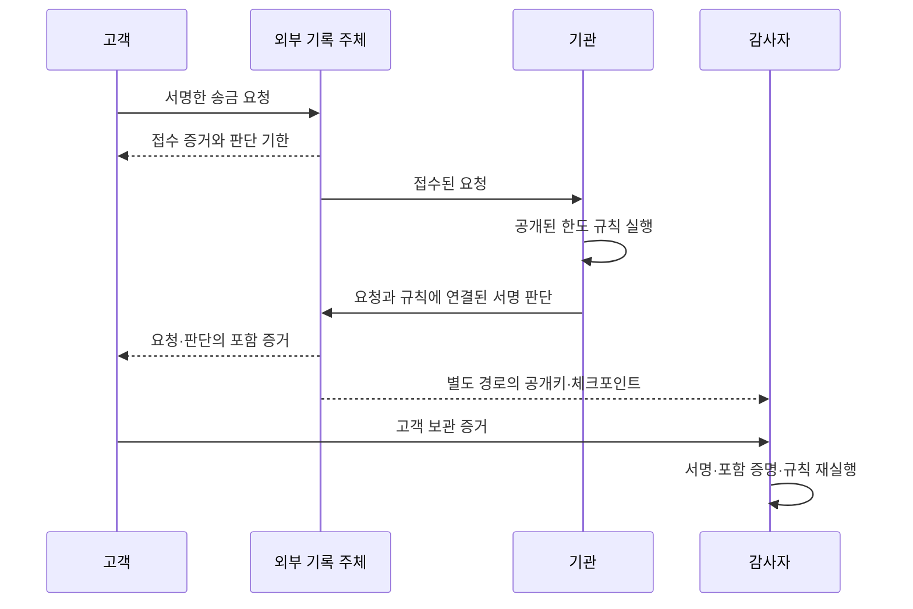

# TRUST404 — 테스트넷 자동 기록·독립 감사

요청과 거절 판단을 서명한 뒤 Merkle root를 체인에 등록하고, 감사자가 파일과 독립 RPC로 기록 및 정책 판단을 검증합니다. 검증 성공은 송금 승인이 아니라 기록과 판단의 일치를 의미합니다.

## 현재 구현과 범위

- 감사 UI: 파일 하나를 입력하면 서버에 사전 등록된 신뢰 기준을 선택해 검증합니다. 지갑은 필요 없습니다.
- 자동 운영: 전용 운영 지갑으로 요청 batch → 블록 상태 조회 → 판단 → 판단 batch → 감사 파일을 생성합니다. 반복 MetaMask 서명은 없습니다.
- SQLite와 파일 outbox, 배치별 서명 거래 journal로 재시작 및 동일 거래 재전송을 처리합니다.
- 정상·변조·자료 유실 검증은 기존 수동 지갑으로 Base Sepolia에서 확인했습니다. 새 자동 worker의 3건 처리·재시작·중복 방지는 로컬 Anvil에서 검증했습니다. 자동 지갑으로도 Base Sepolia 계약 배포와 요청 3건의 자동 등록·거절 판단·감사를 확인했습니다 (2026-09-20, PROVISIONAL).
- 자동 worker는 직접 RPC를 사용합니다. Aomi는 기존 계약 읽기를 검증했으며 자동 서명/전송 경로는 아직 연결하지 않았습니다.
- 요청자·기관 키는 로컬 시연용입니다. 실제 고객 인증·요청자 키 소유 증명·외부 공개 저장소·운영용 KMS는 미구현입니다.

## 확인된 자동 운영 테스트넷

- 계약: [0x4b2ac7775fccc52b9b87a49163077b2e19273d96](https://sepolia.basescan.org/address/0x4b2ac7775fccc52b9b87a49163077b2e19273d96)
- 요청 3건, 배치 2개, 모두 기한 내 거절 등록 및 정책 재검증 일치.
- 기준 블록 47052458, 결과 `ok: true`, `PROVISIONAL`.
- RPC의 일시적 BlockNotFound 이후 같은 journal로 재실행해 완료했습니다. 첫 시도부터 무오류였다는 의미는 아닙니다.

2026-09-20 추가 E2E: `submit`으로 새 요청을 처리한 뒤 export 파일을 별도 감사 HTTP 서버에 가져와 요청 4건·배치 4개, `ok: true`, `PROVISIONAL`을 확인했습니다. RPC의 일시적 블록 조회 실패 후 같은 중복 방지 키로 재개했습니다.

## 설치

저장소 루트에서 Node.js 22.22.2 이상, npm, Foundry의 forge/anvil이 필요합니다. 패키지 설치와 테스트넷 실행에는 네트워크 연결이 필요합니다.

```sh
npm ci
forge build
npm run test:integration
```

## 자동 운영 E2E

### 1. 전용 지갑 생성 및 충전

```sh
npm run operator -- init
```

출력된 `address`에 **Base Sepolia test ETH만** 보냅니다. 개인 지갑 키를 가져올 필요가 없습니다. 로컬 테스트용 키는 Git에서 제외되는 `.local-demo/operator/secrets.json`에 권한 0600으로 저장합니다. 이는 OS 접근 권한으로 보호한 평문 파일이며 운영용 비밀 저장소가 아닙니다. 폴더를 삭제하면 서명 키와 기록을 잃습니다.

```sh
npm run operator -- status
npm run operator -- deploy
```

`deploy`는 전용 지갑을 publisher로 새 RecordAnchor를 한 번 배포합니다. 이미 배포된 경우 주소를 반환합니다. 거래당 최대 예상 비용은 0.001 test ETH, 하루 예약 비용 한도는 0.01 test ETH입니다. 가스 부족이나 한도 초과 시 중단합니다. 계정은 이 worker만 사용하세요.

### 2. 한 번에 요청 처리와 감사 파일 저장

지갑 충전과 최초 계약 배포를 마친 뒤 실행합니다. 1 USDC = 1000000 최소 단위이며 마지막 값은 중복 방지 키입니다.

```sh
npm run operator -- submit 50000000 demo-1
```

이 명령은 요청 저장 → 요청 등록 거래 확인 → 등록 블록 상태로 판단 → 판단 등록 거래 확인 → 독립 감사 → 공유용 파일 저장까지 수행합니다. 종료 코드 0과 `status: RECORDED`가 처리 완료 기준입니다. `auditOk`는 감사 결과이며, 이상이 발견돼도 증거 파일은 저장합니다. `PROVISIONAL`은 등록 거래는 확인했지만 체인의 최종 확정은 기다리는 상태입니다. 현재는 정책 판단과 증거 등록만 수행하며, USDC를 실제 송금하지 않습니다.

실패하면 같은 명령·같은 키로 재실행합니다. 저장된 거래 hash를 재확인하고 완료된 요청을 중복 생성하지 않습니다. 다른 금액에 같은 키를 쓰면 거부합니다. `run` worker가 실행 중이라면 먼저 정상 종료한 뒤 `submit`을 사용하세요.

성공 시 출력된 `exportDirectory`에는 다음 **공개 파일만** 들어갑니다.

- `audit.json`: 요청·판단·상태 증거. 감사 화면에 가져올 파일.
- `trust.json`: 기관·요청자 공개키, 정책, 기록 계약. 감사자가 별도 경로로 진위를 확인할 기준.
- `profiles.json`: 감사 서버 설정. 다른 컴퓨터로 폴더를 옮겨도 상대 경로로 읽습니다.
- `audit-result.json`: 생성 당시 감사 결과. 나중의 재검증을 대신하지 않습니다.

개인키·DB·서명 거래 journal은 export에 포함되지 않습니다. `.local-demo/operator` 전체를 공유하지 마세요.

### 3. 파일을 가져와 독립 감사

감사자는 `npm ci` 이후 전달받은 **export 폴더**의 신뢰 기준을 별도 경로로 확인하고 실행합니다. 지갑, Foundry, 기관 DB 없이 공개 RPC로 검증합니다.

```sh
npm run audit:serve -- .local-demo/operator/exports/demo-1/profiles.json
```

다른 컴퓨터에서는 전달받은 폴더의 `profiles.json` 경로를 사용합니다. http://127.0.0.1:4040 에서 같은 폴더의 `audit.json`을 가져와 **파일 검증**을 누릅니다. 포트가 사용 중이면 명령 끝에 `4042`처럼 다른 포트를 지정합니다. 업로드 파일은 신뢰 키·계약·RPC를 지정할 수 없습니다.

감사는 최신 등록 범위 전체를 확인합니다. export 이후 새 기록이 추가됐다면 오래된 파일은 자료 누락으로 표시될 수 있으므로 최신 export를 전달해야 합니다. `asOf: auto`는 모든 배치가 최종 확정 블록에 포함됐으면 `FINALIZED`, 아직이면 `PROVISIONAL`을 표시합니다. 깊은 reorg 자동 복구는 미구현입니다.

여러 요청을 모아 처리하려면 기존 큐 명령을 사용합니다.

```sh
npm run operator -- request 50000000 demo-2
npm run operator -- request 50000000 demo-3
npm run operator -- tick
# 또는 상시 처리 (Ctrl+C로 정상 종료)
npm run operator -- run
```

강제 종료 후 잠금이 남으면 `operator.lock`의 PID가 종료됐는지 확인한 뒤 잠금만 제거합니다. journal은 삭제하지 않습니다. 장기 pending·revert·수수료 급등은 운영자 조치가 필요합니다.

### 4. 결과 해석

- 정상: `ok: true`, `record: VALID`, `policy: MATCH`.
- 판단 내용 변경: `TAMPERED_EXPORT`.
- 등록된 batch의 원문 제거: `DATA_UNAVAILABLE`. 판단의 옳고 그름은 확인 불가입니다.
- 판단 미등록 또는 지연: 요청 등록과 90초 기한을 비교합니다. 기관이 접수 이전부터 숨긴 요청까지 탐지한다는 보장은 아닙니다.

## 기존 MetaMask 수동 시연

기존 로컬 설정이 있는 컴퓨터에서 `node src/demo/testnet.js`로 http://127.0.0.1:4041 을 엽니다. 이 스크립트는 기존 `.local-demo/base-sepolia-deployed.json`에 의존하는 **요청 한 건 전용 시연**입니다. 새 clone의 시작점은 위 자동 운영 절차입니다.

서명 2회가 완료되면 정상·변조·누락 파일을 다운로드할 수 있습니다. 기존 계약의 publisher는 변경 불가능하므로 전용 자동 지갑이 기존 개인 지갑 계약에 기록을 추가할 수는 없습니다.

## 소스 안내

| 경로 | 역할 |
|---|---|
| `src/operator/run.js` | 전용 지갑, 영속 요청 큐, 자동 등록 worker |
| `src/v3/store.js` | SQLite 기록, 배치 고정, 판단 저장 |
| `src/v3/policy.js` | 서명 검증과 결정론적 판단 |
| `src/v3/verify.js` | 독립 감사 |
| `contracts/RecordAnchor.sol` | root 등록·등록 권한 제한 |
| `src/demo/` | 감사 UI와 수동 운영 도구 |

[Aomi 및 서명 방식 비교](docs/automation-options.md)

---

## 이전 오프라인 프로토타입 (별도 실행 경로)

아래는 `src/cli.js` 기반 초기 모델입니다. 위 v3 테스트넷 실행 경로와 파일 형식이 다릅니다.

# Trust404 — 거절에도 영수증이 필요하다

150만 원을 송금하려던 고객이 “1회 한도 100만 원 초과”로 거절당했습니다. 돈이 이동하지 않아 송금 내역은 없습니다. 기관이 나중에 거절 이유를 바꾸거나 요청 자체를 지우면, 고객은 무엇으로 사실을 입증할까요?

이 프로토타입은 **요청 접수부터 판단까지 외부 증거를 남기고, 기관 저장소 없이 그 증거를 검증**합니다. 거절 한 건의 진위를 확인하고, 지정된 감사 범위에서 기록 삭제와 미처리 요청을 찾아냅니다.

## 바로 실행

Node.js 22 이상이 필요합니다. 외부 패키지 설치와 네트워크 연결은 필요 없습니다. 저장소 루트에서 실행합니다.

```sh
npm test
node src/cli.js demo demo-output
node src/cli.js verify demo-output/customer/rejection.json demo-output/auditor/trust.json
node src/cli.js verify demo-output/customer/approval.json demo-output/auditor/trust.json
node src/cli.js audit demo-output/witness/log.json demo-output/auditor/trust.json
```

`demo-output`이 이미 있으면 덮어쓰지 않습니다. 다음 실행에는 새 경로를 주거나 `npm run demo`로 시각이 붙은 새 디렉토리를 만드세요.

정상 거절 증거의 검증 결과는 `ok: true`, `outcome: REJECTED`, `reason: LIMIT_EXCEEDED`입니다. **검증 성공은 송금 승인을 뜻하지 않습니다.** 판단이 기록·서명·규칙과 일치한다는 뜻입니다.

## 3분 시연

1. `demo`로 150만 원 거절과 50만 원 승인을 생성합니다. 정상 검증과 다섯 가지 공격 검사를 자동으로 실행합니다.
2. `verify`를 별도 프로세스에서 실행합니다. 고객 증거와 감사자 신뢰 파일만 읽으며 기관 저장 파일을 읽지 않습니다. 이 두 파일을 다른 컴퓨터로 옮겨도 검증할 수 있습니다.
3. `demo-output/institution` 폴더를 다른 위치로 옮긴 뒤 같은 검증을 반복합니다. 기관 기록이 없어도 거절 사실은 남습니다. 자동 테스트에서는 실제로 해당 임시 폴더를 삭제하고 검증합니다.
4. 아래 공격 파일들을 검증해 탐지 결과를 보여줍니다.

```sh
# 사후 거절 사유 변경: INVALID_INCLUSION_PROOF, 종료 코드 1
node src/cli.js verify demo-output/attacks/tampered.json demo-output/auditor/trust.json

# 전체 제출 목록에서 거절 한 건 삭제: LOG_SIZE_MISMATCH, 종료 코드 1
node src/cli.js audit demo-output/attacks/deleted-log.json demo-output/auditor/trust.json

# 접수 후 판단을 처음부터 남기지 않음: overdue에 unanswered 표시, 종료 코드 1
node src/cli.js audit demo-output/attacks/missing-log.json demo-output/attacks/missing-trust.json

# 기관이 허위 승인에 실제로 서명했어도: POLICY_MISMATCH, 종료 코드 1
node src/cli.js verify demo-output/attacks/wrong-policy-result.json demo-output/attacks/wrong-policy-trust.json
```

`missing-*`와 `wrong-policy-*`는 별도 키와 로그를 사용하는 독립 공격 사례입니다. 공격 파일이 자신의 신뢰 기준을 정하는 실제 운영 흐름이 아닙니다. 감사자는 각 시연 환경의 신뢰 파일을 사전에 전달받았다고 가정합니다.

## 증거가 만들어지는 과정



요청은 고객 키로, 판단은 기관 키로 서명합니다. 기관은 요청 내용과 적용 정책의 해시를 판단에 연결합니다. 외부 기록 주체는 요청과 판단에 순번을 부여하고 Merkle 루트와 크기에 서명합니다. 단건 검증은 요청과 판단의 포함 증명을 확인하고, 전체 감사는 고정된 범위의 모든 기록을 대조합니다.

고객 접수 증거는 판단 전에 파일로 저장됩니다. 데모 로그 저장이 실패하면 요청·판단의 성공 응답도 반환하지 않습니다. 외부 기록 파일은 정상 작업에서 추가만 하며, 파일을 직접 편집하는 공격은 사전에 보관한 체크포인트와 비교하여 탐지합니다.

## 무엇을 보장하는가

| 평가 항목 | 검증 근거 | 한계 |
| --- | --- | --- |
| 불변성 | 서명과 고정 Merkle 루트 | 파일 편집을 물리적으로 금지하는 대신 탐지 |
| 완전성 | 감사 범위의 크기·루트, 접수와 판단의 대조 | 외부에 접수되지 않은 요청은 탐지 불가 |
| 독립 검증 | 별도로 확보한 공개키와 체크포인트 | 그 기준의 안전한 전달을 가정 |
| 부인 방지 | 고객의 요청 서명과 기관의 판단 서명 | 키 소유·보호를 가정; 고객의 판단 동의는 의미하지 않음 |
| 사유 검증 | 서명된 입력과 정책으로 판단 재실행 | 현실 입력의 진실성이나 숨은 동기는 증명하지 않음 |

현재는 한 머신에서 역할별 키·폴더를 분리한 **로컬 모의 프로토타입**입니다. 생성기는 모든 역할의 키를 메모리에 보유하며 개인키는 파일에 저장하지 않습니다. 실제 외부 운영, 온체인 앵커, 분산 합의, 로그 분기 방지, 운영용 키 관리, 프로세스 재시작 복구는 구현하지 않았습니다. 판단 시각도 시연을 위해 증가시키는 모의 시계입니다. 기한 전 판단 없음은 `pending`, 기한 경과 후는 `overdue`로 구분합니다.

공개키와 체크포인트까지 공격자가 함께 바꿀 수 있다면 독립 검증은 성립하지 않습니다. 과거 체크포인트로 검증한 결과는 그 범위에만 유효하며 최신 전체 기록을 보장하지 않습니다.

## 참고와 문서

- [시나리오](SCENARIO.md), [요구사항·증거 스키마](REQUIREMENTS.md), [테스트 스위트](TEST-SUITE.md), [검증 기록](VALIDATION.md), [용어](CONTEXT.md)
- [Tessera](../reference-projects/tessera/README.md): 추가 전용 Merkle 로그, 순번, 체크포인트 아이디어를 참고했습니다.
- [daryl의 서명 기본 요소](../reference-projects/daryl/packages/dsm-primitives/README.md): 정규 직렬화·해시·서명 분리를 참고했습니다. 바이트 포맷 호환 구현은 아닙니다.
- [Linera](../reference-projects/linera-protocol/README.md): 외부 체인 앵커 후보를 검토했으나 이번 로컬 시연에는 연동하지 않았습니다.

`src/evidence.js`는 증거 생성과 독립 검증 함수, `src/cli.js`는 파일 기반 실행 도구입니다. 전체 감사는 로그 전체를 읽는 단순한 구현입니다. 성능보다 요구사항 충족을 우선했습니다.

### Aomi hosted signing 상태 (2026-09-20)

직접 RPC 운영 worker는 테스트넷에서 검증했지만, Aomi hosted 자동 전송은 아직 완료되지 않았습니다. Privy 지갑 `0xb88122f378189b3dac4efea164181e2191489726`은 앞선 Portal 확인에서 Auto·위임 만료 2026-09-27로 표시됐습니다. 04:31 UTC 조회 잔액은 0.001 test ETH입니다.

Pipeline의 `custody:delegate` 승인은 완료됐습니다. 04:28 UTC 재현에서 실제 전송 토큰이 승인된 Pipeline grant와 일치함을 해시 지문으로 확인했고, 환경변수·활성 세션에 `accountBearer` override가 없었습니다. 새 `publisher()` Build의 stage/simulate는 성공했으나 commit은 `422 / pipeline_commit_failed`입니다. 이 오류만으로 서버 장애나 단일 원인을 확정하지 않습니다.

Agent grant는 별도로 `custody:delegate`가 없으므로 과거 Agent의 scope 오류를 현재 Pipeline의 원인으로 혼동하면 안 됩니다. CLI 계정 조회는 `/api/account`에서 401을 반환해 backend 위임 상태를 확인하지 못했습니다. Privy 지갑은 기존 계약의 publisher와도 다르므로 hosted 전송이 해결된 뒤 실제 기록 계약의 publisher를 맞추는 별도 작업이 필요합니다.

민감정보를 제외한 재현 결과와 Aomi 측 확인 항목: [Pipeline 진단 기록](docs/aomi-pipeline-diagnostic.md). 승인·추가 충전·signer 재설치는 반복하지 않았습니다.
