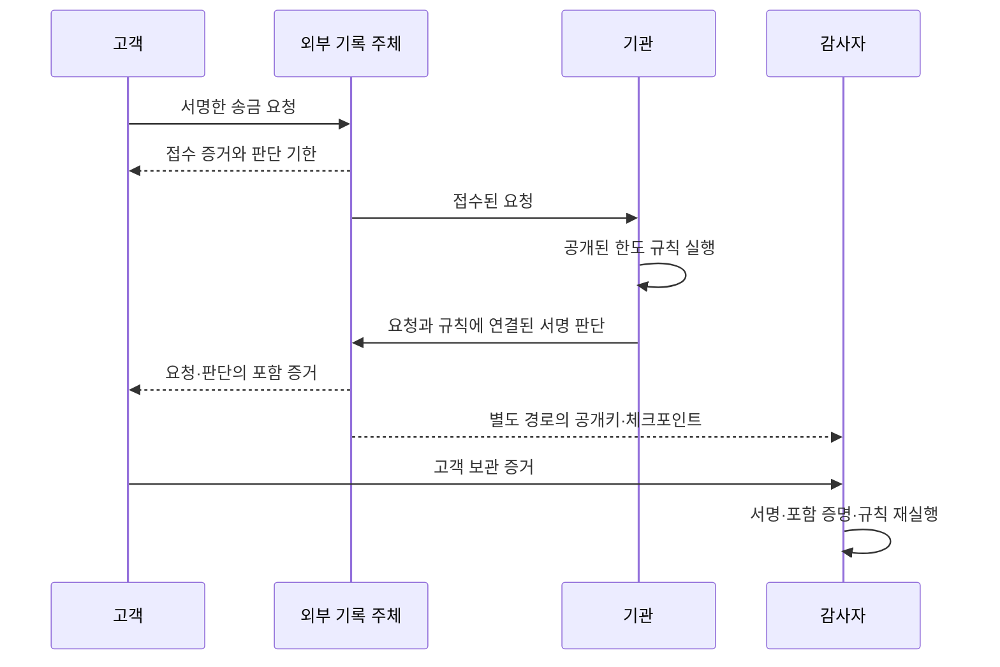

# Trust404 — 거절에도 영수증이 필요하다

150만 원을 송금하려던 고객이 “1회 한도 100만 원 초과”로 거절당했습니다. 돈이 이동하지 않아 송금 내역은 없습니다. 기관이 나중에 거절 이유를 바꾸거나 요청 자체를 지우면, 고객은 무엇으로 사실을 입증할까요?

이 프로토타입은 **요청 접수부터 판단까지 외부 증거를 남기고, 기관 저장소 없이 그 증거를 검증**합니다. 거절 한 건의 진위를 확인하고, 지정된 감사 범위에서 기록 삭제와 미처리 요청을 찾아냅니다.

## 바로 실행

Node.js 22 이상이 필요합니다. 외부 패키지 설치와 네트워크 연결은 필요 없습니다. 저장소 루트에서 실행합니다.

```sh
cd track3
npm test
node src/cli.js demo demo-output
node src/cli.js verify demo-output/customer/rejection.json demo-output/auditor/trust.json
node src/cli.js verify demo-output/customer/approval.json demo-output/auditor/trust.json
node src/cli.js audit demo-output/witness/log.json demo-output/auditor/trust.json
```

`demo-output`이 이미 있으면 덮어쓰지 않습니다. 다음 실행에는 새 경로를 주거나 `npm run demo`로 시각이 붙은 새 디렉토리를 만드세요.

정상 거절 증거의 검증 결과는 `ok: true`, `outcome: REJECTED`, `reason: LIMIT_EXCEEDED`입니다. **검증 성공은 송금 승인을 뜻하지 않습니다.** 판단이 기록·서명·규칙과 일치한다는 뜻입니다.

## 3분 시연

1. `demo`로 150만 원 거절과 50만 원 승인을 생성합니다. 정상 검증과 다섯 가지 공격 검사를 자동으로 실행합니다.
2. `verify`를 별도 프로세스에서 실행합니다. 고객 증거와 감사자 신뢰 파일만 읽으며 기관 저장 파일을 읽지 않습니다. 이 두 파일을 다른 컴퓨터로 옮겨도 검증할 수 있습니다.
3. `demo-output/institution` 폴더를 다른 위치로 옮긴 뒤 같은 검증을 반복합니다. 기관 기록이 없어도 거절 사실은 남습니다. 자동 테스트에서는 실제로 해당 임시 폴더를 삭제하고 검증합니다.
4. 아래 공격 파일들을 검증해 탐지 결과를 보여줍니다.

```sh
# 사후 거절 사유 변경: INVALID_INCLUSION_PROOF, 종료 코드 1
node src/cli.js verify demo-output/attacks/tampered.json demo-output/auditor/trust.json

# 전체 제출 목록에서 거절 한 건 삭제: LOG_SIZE_MISMATCH, 종료 코드 1
node src/cli.js audit demo-output/attacks/deleted-log.json demo-output/auditor/trust.json

# 접수 후 판단을 처음부터 남기지 않음: overdue에 unanswered 표시, 종료 코드 1
node src/cli.js audit demo-output/attacks/missing-log.json demo-output/attacks/missing-trust.json

# 기관이 허위 승인에 실제로 서명했어도: POLICY_MISMATCH, 종료 코드 1
node src/cli.js verify demo-output/attacks/wrong-policy-result.json demo-output/attacks/wrong-policy-trust.json
```

`missing-*`와 `wrong-policy-*`는 별도 키와 로그를 사용하는 독립 공격 사례입니다. 공격 파일이 자신의 신뢰 기준을 정하는 실제 운영 흐름이 아닙니다. 감사자는 각 시연 환경의 신뢰 파일을 사전에 전달받았다고 가정합니다.

## 증거가 만들어지는 과정



요청은 고객 키로, 판단은 기관 키로 서명합니다. 기관은 요청 내용과 적용 정책의 해시를 판단에 연결합니다. 외부 기록 주체는 요청과 판단에 순번을 부여하고 Merkle 루트와 크기에 서명합니다. 단건 검증은 요청과 판단의 포함 증명을 확인하고, 전체 감사는 고정된 범위의 모든 기록을 대조합니다.

고객 접수 증거는 판단 전에 파일로 저장됩니다. 데모 로그 저장이 실패하면 요청·판단의 성공 응답도 반환하지 않습니다. 외부 기록 파일은 정상 작업에서 추가만 하며, 파일을 직접 편집하는 공격은 사전에 보관한 체크포인트와 비교하여 탐지합니다.

## 무엇을 보장하는가

| 평가 항목 | 검증 근거 | 한계 |
| --- | --- | --- |
| 불변성 | 서명과 고정 Merkle 루트 | 파일 편집을 물리적으로 금지하는 대신 탐지 |
| 완전성 | 감사 범위의 크기·루트, 접수와 판단의 대조 | 외부에 접수되지 않은 요청은 탐지 불가 |
| 독립 검증 | 별도로 확보한 공개키와 체크포인트 | 그 기준의 안전한 전달을 가정 |
| 부인 방지 | 고객의 요청 서명과 기관의 판단 서명 | 키 소유·보호를 가정; 고객의 판단 동의는 의미하지 않음 |
| 사유 검증 | 서명된 입력과 정책으로 판단 재실행 | 현실 입력의 진실성이나 숨은 동기는 증명하지 않음 |

현재는 한 머신에서 역할별 키·폴더를 분리한 **로컬 모의 프로토타입**입니다. 생성기는 모든 역할의 키를 메모리에 보유하며 개인키는 파일에 저장하지 않습니다. 실제 외부 운영, 온체인 앵커, 분산 합의, 로그 분기 방지, 운영용 키 관리, 프로세스 재시작 복구는 구현하지 않았습니다. 판단 시각도 시연을 위해 증가시키는 모의 시계입니다. 기한 전 판단 없음은 `pending`, 기한 경과 후는 `overdue`로 구분합니다.

공개키와 체크포인트까지 공격자가 함께 바꿀 수 있다면 독립 검증은 성립하지 않습니다. 과거 체크포인트로 검증한 결과는 그 범위에만 유효하며 최신 전체 기록을 보장하지 않습니다.

## 참고와 문서

- [시나리오](SCENARIO.md), [요구사항·증거 스키마](REQUIREMENTS.md), [테스트 스위트](TEST-SUITE.md), [검증 기록](VALIDATION.md), [용어](CONTEXT.md)
- [Tessera](../reference-projects/tessera/README.md): 추가 전용 Merkle 로그, 순번, 체크포인트 아이디어를 참고했습니다.
- [daryl의 서명 기본 요소](../reference-projects/daryl/packages/dsm-primitives/README.md): 정규 직렬화·해시·서명 분리를 참고했습니다. 바이트 포맷 호환 구현은 아닙니다.
- [Linera](../reference-projects/linera-protocol/README.md): 외부 체인 앵커 후보를 검토했으나 이번 로컬 시연에는 연동하지 않았습니다.

`src/evidence.js`는 증거 생성과 독립 검증 함수, `src/cli.js`는 파일 기반 실행 도구입니다. 전체 감사는 로그 전체를 읽는 단순한 구현입니다. 성능보다 요구사항 충족을 우선했습니다.
