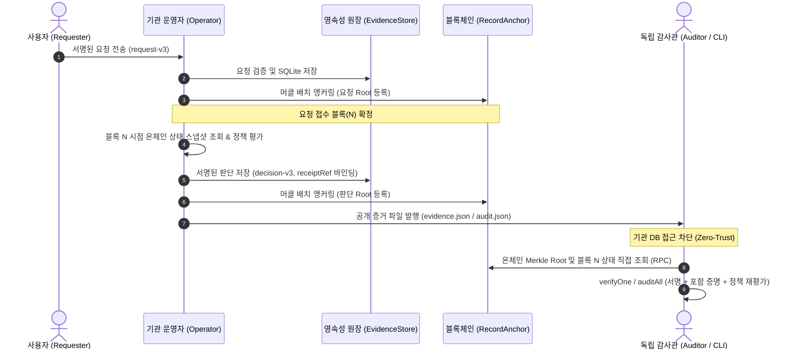

# TRUST404 Core System Architecture (`src/`)

본 디렉터리는 **기관의 서버나 데이터베이스를 전혀 신뢰하지 않고도, 오프체인 의사결정(승인/거절)의 진위와 정책 준수 여부를 제3자가 독립적으로 검증할 수 있도록 지원하는 무신뢰(Zero-Trust) 감사 인프라의 핵심 코어**입니다.

---

## 1. 아키텍처 설계 원칙 (Design Principles)

1. **선(先)요청 앵커링 (Commitment-First)**:
   판단(승인/거절)을 내리기 전에 사용자의 요청을 온체인 배치에 먼저 등록합니다. 이를 통해 기관이 불리한 요청을 사후에 은폐하거나 삭제(Censorship)하는 행위를 원천 차단합니다.
2. **2계층 독립 검증 (2-Layer Independent Verification)**:
   - **Layer 1 (기록 무결성)**: 서명과 머클 증명을 통해 원문 데이터가 블록체인에 등록된 루트와 일치하는지 확인.
   - **Layer 2 (결정론적 정책 재평가)**: 요청 당시 온체인 상태(N번 블록의 담보/부채/준비금)를 스냅샷으로 재현하여, 감사자가 동일한 정책 코드로 재평가(Replay)했을 때 기관의 판단 사유와 1 bit도 틀림없이 일치하는지 확인.
3. **엄격한 스키마 및 정규화 (RFC Compliance)**:
   데이터 조작이나 파싱 차이(Parser Differential) 공격을 막기 위해 정규 JSON(RFC 8785 JCS), 해시 기반 머클 트리(RFC 6962), Ed25519 엔벨로프 서명 규격을 엄격히 준수합니다.

---

## 2. 엔드-투-엔드 데이터 파이프라인 (Data Flow)



---

## 3. 디렉터리 및 모듈별 책임 (Module Inventory)

```text
src/
├── common/             # [기반 계층] 공통 암호학, 머클 트리, RPC, 컨트랙트 ABI
│   ├── crypto.js       # RFC 8785 JCS 정규화, SHA-256(도메인 분리), Ed25519 서명/검증
│   ├── merkle.js       # RFC 6962 표준 이진 머클 트리 빌더 및 포함 증명(Audit Path) 검증
│   ├── rpc.js          # 무의존성 JSON-RPC 2.0 클라이언트 및 BigInt 수량 포맷터
│   ├── abi.js          # RecordAnchor, CreditState, ERC-20 인터페이스 ABI
│   └── index.js        # common 모듈 배럴 export
├── policy/             # [도메인 계층] 금융 정책 평가 및 결정론적 룰 엔진
│   └── policy.js       # USDC 준비금 정책, LTV 담보 정책, 스냅샷 규격 검증, 정책 재평가
├── verifier/           # [검증 계층] 제3자 독립 검증 및 전수 감사 코어
│   ├── verify.js       # 단건 독립 검증(verifyOne), 전수 누락/위변조 감사(auditAll), SLA 타이밍
│   └── finality.js     # 감사 기준 체인 완결성(Finality: Finalized vs Provisional) 뷰 결정기
├── chain/              # [인프라 계층] 온체인 인터페이스 및 상태 재생(Replay) 런타임
│   ├── reader.js       # 온체인 블록/배치 조회기 (ChainReader, ChainView, anchorCall)
│   └── rpc-runtime.js  # N번 블록 상태 재현(Replay) 및 로컬 트랜잭션 시뮬레이션 하네스
├── storage/            # [영속성 계층] 무결성 보존 저장소
│   └── store.js        # SQLite WAL 원장(EvidenceStore) 및 덮어쓰기 불허 파일 아카이브(Archive)
├── server/             # [통신 계층] 내부 증거 관리 HTTP API
│   └── server.js       # 서명된 요청 접수, 배치 준비, 2계층 검증 JSON 반환 엔드포인트
├── operator/           # [운영 계층] 기관 배치 제출 데몬 및 Aomi 연동
│   ├── run.js          # 지갑 초기화, 트랜잭션 앵커링, 장애 복구 저널, 증거 export 데몬
│   └── aomi.js         # Aomi Agent SDK 및 SIWE 연동, 시뮬레이션 성공 필수 검증기
└── cli.js              # [진입점] 독립 제3자 검증 통합 CLI (verify, audit, serve)
```

---

## 4. 암호학 및 데이터 표준 명세 (Cryptographic Specs)

| 기술 요소 | 표준 규격 | 시스템 적용 방식 및 특징 |
| :--- | :--- | :--- |
| **정규 JSON** | **RFC 8785 (JCS)** | 키 사전순 정렬, 공백 제거, IEEE 754 부동소수점 정규화. 비정규 포맷 수신 시 즉시 차단. |
| **머클 트리** | **RFC 6962** | Leaf: `SHA256(0x00 \|\| UTF8(JCS(record)))`<br>Branch: `SHA256(0x01 \|\| Left \|\| Right)` (2의 거듭제곱 분할) |
| **전자서명** | **Ed25519** | 메시지 엔벨로프 `{ domain, keyId, payload, signature }`<br>도메인 분리(`request-v3`, `decision-v3`) 적용 |
| **온체인 앵커** | **EVM Contract** | `RecordAnchor.sol`에 배치 ID별 `root`, `count`, `blockNumber`, `anchoredAt` 영구 불변 기록 |

---

## 5. 핵심 에러 코드 매트릭스 (Error Code Matrix)

감사 과정에서 탐지되는 모든 이상 징후는 명확한 표준 에러 코드로 분기됩니다:

| 에러 코드 | 검증 계층 | 발생 원인 및 보안 의미 |
| :--- | :--- | :--- |
| **`TAMPERED_EXPORT`** | Layer 1 (무결성) | 아카이브 원본 또는 내보낸 증거 파일의 내용이 변조되어 온체인 Merkle Root와 불일치함. |
| **`INVALID_INCLUSION`** | Layer 1 (무결성) | 머클 포함 증명(Merkle Audit Path) 경로 해시가 유효하지 않거나 위조됨. |
| **`INVALID_SIGNATURE`** | Layer 1 (무결성) | 요청자 또는 기관의 Ed25519 전자서명이 서명자 공개키와 불일치함. |
| **`DATA_UNAVAILABLE`** | Layer 1 (보관성) | 온체인에는 앵커링되었으나, 기관이 해당 배치의 원문 레코드를 유실/은폐함. |
| **`MISSING_AS_OF_H`** | Layer 2 (SLA) | 요청이 등록된 후 약정 기한(예: 90초)이 경과하도록 온체인에 판단 결과가 등록되지 않음. |
| **`POLICY_MISMATCH`** | Layer 2 (정책 준수) | 기관이 서명한 거절/승인 사유가 당시 블록의 온체인 스냅샷으로 재평가한 결과와 다름 (허위 서명 적발). |

---

## 6. 독립 검증 CLI 사용법 (`src/cli.js`)

기관 서버나 DB 접속 없이, 독립된 감사관 컴퓨터에서 온체인 RPC와 공개 파일만으로 검증을 수행합니다.

### 1) 단건 증거 검증 (`verify`)
```bash
node src/cli.js verify <config.json> <evidence.json>
```
- **검증 항목**: 요청자/기관 서명, 온체인 머클 포함 증명, 블록 당시 스냅샷 상태 대조 및 정책 재평가.
- **출력**: `ok: true`, `outcome: "REJECTED"`, `reason: "RESERVE_FLOOR"`, `asOf: { blockHash: "0x..." }`

### 2) 배치 전수 감사 (`audit`)
```bash
node src/cli.js audit <config.json> <archive_directory>
```
- **검증 항목**: 감사 기준 블록까지 체인에 기록된 모든 배치의 완전성, 누락, 위변조, SLA 지연 검사.
- **출력**: `complete: true`, `issues: []`, `batchCount: N`, `finality: "FINALIZED"`
